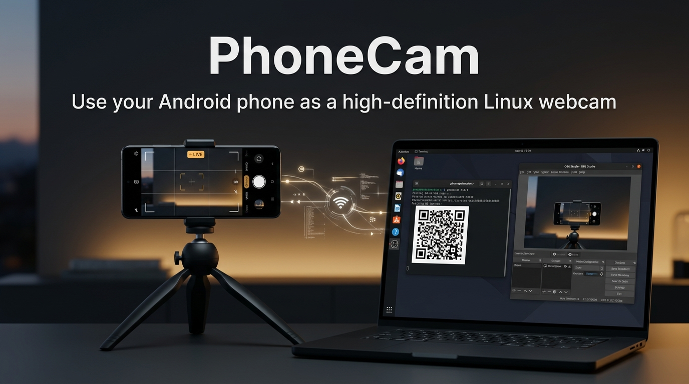

# PhoneCam

<p align="center">
  
</p>

Most laptop webcams produce grainy, washed-out video. PhoneCam turns your Android phone into a high-definition webcam for Linux over your local network. It shows up in Google Meet, Zoom, Discord, OBS Studio, and web browsers as a standard camera.

Video streams directly from your phone to your computer over local Wi-Fi. There are no accounts, cloud servers, or subscriptions.

## Download

Get the Android app and Linux packages from the [latest release](https://github.com/kvm404/phonecam/releases/latest).

### Android app

Download and install the APK on your phone:
- [Android APK on latest release](https://github.com/kvm404/phonecam/releases/latest)

You may need to allow installation from unknown sources in your Android settings.

### Linux CLI

Download the package for your distribution from the [latest release](https://github.com/kvm404/phonecam/releases/latest):

- **Ubuntu / Debian**: download the `.deb` and run:
  ```sh
  sudo apt install ./phonecam_*_amd64.deb
  ```
- **Fedora**: enable RPM Fusion free, download the `.rpm`, and run:
  ```sh
  sudo dnf install ./phonecam-*.x86_64.rpm
  ```
- **Arch Linux**: download the `.pkg.tar.zst` and run:
  ```sh
  sudo pacman -U ./phonecam-*-x86_64.pkg.tar.zst
  ```
- **Standalone binary**: prebuilt binaries (`phonecam-linux-amd64` and `phonecam-linux-arm64`) are also available on the release page.

After installing the CLI package, run the setup command once to configure the virtual camera device:

```sh
sudo phonecam setup
phonecam doctor
```

## How to use

1. Start PhoneCam in your terminal:
   ```sh
   phonecam start
   ```
   A pairing QR code appears in your terminal.

2. Open the PhoneCam app on your phone and tap **Scan QR**. Point the phone at the terminal to pair.

3. Open Google Meet, Zoom, Discord, or OBS Studio, and choose **PhoneCam** as your camera input.

Run `phonecam status` to check streaming health. When you finish, run `phonecam stop`.

## Requirements

- Linux with a modern kernel and local network connection.
- Android 10 or newer (SDK 26+).
- Phone and computer connected to the same Wi-Fi or local network.

## Documentation and license

Detailed architecture notes, media pipeline documentation, and desktop guides live in [docs/](docs/).

Licensed under the [MIT License](LICENSE).
