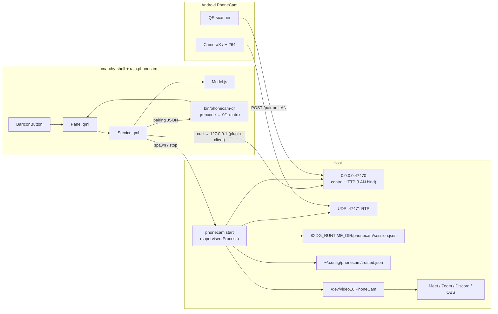
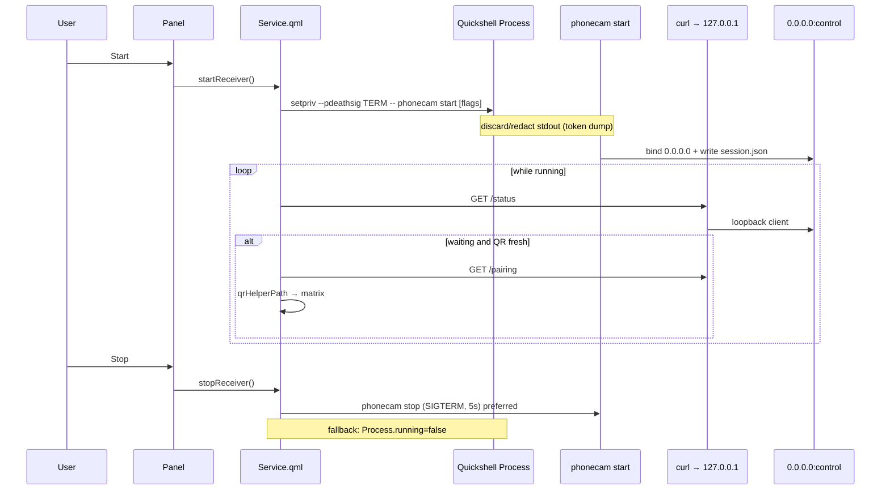

# Omarchy PhoneCam Plugin (`raja.phonecam`)

| Field | Value |
| --- | --- |
| Author | Raja |
| Date | 2026-08-27 |
| Status | Design complete; plugin not implemented |
| Plugin id | `raja.phonecam` |
| New repo | `/home/raja/omarchy-phonecam` |
| Upstream reference (read-only) | `/home/raja/phonecam` (https://github.com/kvm404/phonecam.git) |
| PhoneCam CLI verified | `0.2.0-rc.1` (`linux-cli/internal/cli/cli.go`) |

---

## Overview

PhoneCam already turns an Android phone into a Linux virtual webcam: CameraX → H.264 RTP/UDP → Go CLI + GStreamer → `v4l2loopback` `/dev/video10` (`card_label=PhoneCam`) → Chromium, Discord, Meet, Zoom, OBS. Meeting apps pick the V4L2 device; **no browser extension is required**. The laptop side today is a foreground CLI (`phonecam start`) that prints a terminal QR and owns the process until SIGTERM.

This design specifies an **Omarchy (Quickshell) shell plugin** that wraps that CLI and its loopback HTTP control API so Raja can start/stop the receiver, scan a real QR from the Hyprland bar panel, see live/waiting/offline state, surface doctor failures, and manage trusted phones — without living in a terminal and without reimplementing the media pipeline.

The plugin is a thin operate-mode UI: service-supervised `phonecam start`, HTTP poll of `/status` and `/pairing`, QR matrix rendering (wifiqr pattern), and a native Omarchy panel. Media stays in PhoneCam; QML never touches RTP or GStreamer.

---

## Background & Motivation

### Current state (verified)

- Clone at `/home/raja/phonecam`; Linux CLI under `/home/raja/phonecam/linux-cli/`.
- Commands: `start`, `status`, `stop`, `doctor`, `install`, `trust list|revoke|revoke-all`, `smoke`, `version` (`cli.go`).
- `phonecam start` is **foreground**, records `$XDG_RUNTIME_DIR/phonecam/session.json`, binds control TCP **47470** and RTP UDP **47471** by default (`start.DefaultControlPort` / `DefaultRTPPort`).
- Stop is SIGTERM to the recorded PID, **5s wait, never SIGKILL** (`lifecycle.Stop`).
- Interrupt set includes **SIGHUP** so closing a terminal tears down `gst-launch` instead of leaving `/dev/video10` held (`cli.interruptSignals`).
- Control server binds **`0.0.0.0:<controlPort>`** (`start.listenTCP`); it is LAN-reachable. Loopback-gated only: `GET /pairing`, `POST /approve`, `GET /trust`, `DELETE /trust/{id}`. Network-reachable by design: `GET /healthz`, `GET /status`, `POST /pair`, `POST /reconnect` (`control/server.go`).
- Pairing QR content is **compact JSON** of `pairing.Payload` (`{v,name,laptop_id?,control,rtp,session,token,expires,transport,video}`), TTL **2 minutes** (`pairing.DefaultTTL`). `writeStartOutput` always prints a block QR **and** the full indented pairing JSON (including `token`) to stdout — there is **no** `isatty` / TTY gate (`qrcode.RenderTerminal`, `start.writeStartOutput`). UIs should fetch `GET /pairing` (loopback) rather than parse start stdout.
- Auto-approve is the CLI default; `--require-approval` restores y/N / HTTP approve (`parseStartFlags`).
- LAN RTP is **unencrypted**; doctor emits an INFO check saying so (`doctor.Run`).
- PRD lists “Polished GUI tray” as out of scope for PhoneCam itself (`docs/PRD.md` / `TECHNICAL_DESIGN.md` non-goals).
- On this machine: `phonecam` is **not on PATH**; Go is available via mise (`go 1.27.0`). `qrencode` **is** on PATH (`/usr/bin/qrencode`).

### Pain

Operating PhoneCam from a terminal fights the Omarchy/Hyprland workflow: QR in a TTY is hard to scan, doctor output is text, connection state is invisible from the bar, and closing the wrong terminal SIGHUPs the receiver.

### Opportunity

Omarchy already has the craft patterns this product needs: long-lived process supervision (`bredda.localsend`), on-demand probe + Model.js (`io.github.mich-nduka.omaports`), QR module matrices in QML (`omarchy.wifiqr`), and connection-state hero panels (`omarchy.bluetooth`).

---

## Goals & Non-Goals

### Goals

1. Native Omarchy bar widget + panel for PhoneCam operate mode (start/stop, QR, live status, doctor, trust).
2. Wrap existing `phonecam` CLI + loopback HTTP API only.
3. Pass `omarchy plugin validate` and be installable via `omarchy plugin add <git-url> --enable`.
4. Look native: `qs.Ui` / `qs.Commons`, `Panel`, `BarIconButton`, `Color`, `Style`; theme-driven; operate-mode scanability.
5. Discover/install path for the `phonecam` binary (not currently on PATH).
6. Render a **scannable** QR whose content is the same compact pairing JSON the Android app parses (`PairingPayload.kt`).

### Non-Goals

- Chromium / browser extension.
- Fork or patch of `kvm404/phonecam`.
- Reimplement RTP decode, GStreamer, or v4l2loopback in the plugin.
- Auto-start receiver at shell login.
- Audio, multi-phone, encrypted RTP, systemd unit, D-Bus, websockets.
- Editing `/usr/share/omarchy/` or `/home/raja/phonecam`.
- Docs/STATE.md, session logs, checkpoint files.

---

## Proposed Design

### Architecture



**Bind vs client:** PhoneCam listens on `0.0.0.0` so the phone can hit `/pair` and `/reconnect` on the LAN. The plugin **always** calls `http://127.0.0.1:<controlPort>/…` so privileged endpoints (`/pairing`, `/approve`, `/trust`) succeed the loopback gate. Threat note: `/healthz`, `/status`, `/pair`, and `/reconnect` are network-reachable by design — do not “harden” the CLI bind to loopback from this plugin.

### Plugin layout (new repo `/home/raja/omarchy-phonecam`)

```text
omarchy-phonecam/
  manifest.json
  README.md
  LICENSE
  Model.js                 # pure JS: state machine, parsers, doctor/status shaping
  service/Service.qml      # binary discovery, Process supervisor, HTTP poll, actions
  widget/PhoneCamBar.qml   # BarIconButton + Panel UI (or Panel.qml as entry)
  bin/phonecam-qr          # bash: stdin/arg JSON → 0/1 QR matrix (qrencode)
  assets/phonecam-symbolic.svg
  test/model-test.js
  preview.png              # optional screenshot for README
```

Exact QML filenames may follow localsend (`service/` + `widget/`) or a single `Panel.qml` entry like omaports/agents; the **kinds and responsibilities** below are normative.

### Manifest contract

Required by `/usr/bin/omarchy-plugin-validate` and `PluginRegistry.validateManifest`:

```json
{
  "schemaVersion": 1,
  "id": "raja.phonecam",
  "name": "PhoneCam",
  "version": "0.1.0",
  "author": "Raja",
  "license": "MIT",
  "description": "Turn your Android phone into a virtual webcam from the Omarchy bar: start/stop PhoneCam, scan the pairing QR, and see live status.",
  "kinds": ["service", "bar-widget"],
  "keepLoaded": true,
  "entryPoints": {
    "service": "service/Service.qml",
    "barWidget": "widget/PhoneCamBar.qml"
  },
  "barWidget": {
    "displayName": "PhoneCam",
    "description": "Phone as webcam: start/stop the receiver, pair with QR, doctor, trusted phones.",
    "category": "Devices",
    "aliases": ["phonecam", "webcam", "phone camera", "v4l2"],
    "allowMultiple": false,
    "defaultSection": "right",
    "defaults": {
      "phonecamPath": "",
      "controlPort": 47470,
      "rtpPort": 47471,
      "requireApproval": false,
      "noTrust": false
    },
    "schema": [
      {
        "key": "phonecamPath",
        "type": "path",
        "label": "phonecam binary",
        "defaultValue": "",
        "description": "Empty = search PATH, ~/.local/bin/phonecam, and common build outputs."
      },
      {
        "key": "requireApproval",
        "type": "boolean",
        "label": "Require approval before accepting a phone",
        "defaultValue": false,
        "description": "Passes --require-approval to phonecam start. Approve from the panel via loopback POST /approve."
      },
      {
        "key": "noTrust",
        "type": "boolean",
        "label": "Disable trusted-phone store",
        "defaultValue": false,
        "description": "Passes --no-trust. Phones must scan a new QR every session."
      },
      {
        "key": "controlPort",
        "type": "integer",
        "label": "Control port",
        "min": 0,
        "max": 65535,
        "defaultValue": 47470
      },
      {
        "key": "rtpPort",
        "type": "integer",
        "label": "RTP port",
        "min": 0,
        "max": 65535,
        "defaultValue": 47471
      }
    ]
  }
}
```

**Pins:** `id` must not use `omarchy.*`. No symlinks in the plugin tree (except `.git`). Entry points relative, no `..`. Default bar section **right** (Raja’s current right layout: tray, omaports, localsend, diskspace, system-stats, raja.agents, bluetooth, network, audio, monitor, power).

**Service/Model constants (not widget settings):** keep poll and live thresholds out of `barWidget.defaults` / `schema` so the manifest does not imply user knobs. Documented in Service/Model prose and code:

| Constant | Default | Role |
| --- | --- | --- |
| `POLL_RUNNING_MS` | `1000` | `GET /status` while receiver alive |
| `POLL_STOPPED_MS` | `5000` | Cheap stopped/session probe |
| `LIVE_RTP_MAX_AGE_MS` | `1500` | `live` vs `paired_silent` (CLI sets `request_keyframe` when `last_rtp_ms > 400`) |

### Why `service` + `bar-widget` (+ optional `keepLoaded`)

Closest analog is `bredda.localsend`: a long-lived helper process supervised by a **service** the bar panel talks to via `shell.serviceFor("…")`. PhoneCam differs in one critical way: **the receiver must not start at login**. The service only *supervises when the user starts it*; idle cost is a cheap stopped-state poll.

**Ownership split (verified against `shell.qml`):**

- **`service` kind** — process ownership and polling. Third-party services stay mounted while the plugin `isEnabled` (bar placement is enough; Raja’s `plugins: []` already runs localsend’s service this way). Closing the panel does **not** tear down the service or a supervised `phonecam` Process.
- **`bar-widget` kind** — icon + panel UI. The bar-widget root stays loaded while the widget is placed in `bar.layout`.
- **`keepLoaded: true`** — in the shell, this flag only gates **panel / overlay / menu** Instantiator Loaders. It does **not** keep a `service` alive (services already stay up while enabled) and this plugin does not declare a separate `panel` kind. Keep `keepLoaded: true` for localsend-manifest parity / future-proofing if a `panel` kind is added later; **do not** cite it as the reason Process or bar state survives panel close.

omaports-style “Service inside Panel.qml only” remains a viable alternative (bar widgets stay loaded while placed), but a dedicated service kind matches process ownership more clearly.

### Binary discovery

`phonecam` is not on PATH on this machine. Service resolves the binary once at load and on settings change:

1. Settings `phonecamPath` if set and executable.
2. `command -v phonecam` / PATH lookup via a tiny `["/bin/sh","-c","command -v phonecam"]` probe (or Quickshell equivalent).
3. Candidates in order: `$HOME/.local/bin/phonecam`, `/usr/local/bin/phonecam`, `/usr/bin/phonecam`.
4. Optional documented build path: `$HOME/phonecam/linux-cli` via `go build -o ~/.local/bin/phonecam ./cmd/phonecam` (README). Do **not** hard-require that tree; it is upstream reference.

Bar/panel empty state when unresolved: **“PhoneCam CLI not found”** + exact next step (`go build …` or install instructions). Never spawn arbitrary user strings as the binary path without verifying it is a regular executable file named/path-constrained (allowlist: resolved path only; args fixed by the plugin).

### Plugin-local helper resolution (`bin/phonecam-qr`)

Same pattern as localsend’s `manifest.__sourceDir + "/bin/localsend-controller"` (`bredda.localsend/service/Receiver.qml`):

```qml
readonly property string sourceDir: manifest && manifest.__sourceDir ? String(manifest.__sourceDir) : ""
readonly property string qrHelperPath: sourceDir === "" ? "" : sourceDir + "/bin/phonecam-qr"
```

Before spawn: require `qrHelperPath !== ""`, file exists, and is executable. `omarchy plugin validate` already rejects symlinks in the plugin folder (except `.git`), so `bin/phonecam-qr` must be a real file checked into the repo — never a symlink to system `qrencode`.

### HTTP client mechanism (normative)

Quickshell plugins on this host use **`Process` + allowlisted `curl`** for HTTP (e.g. first-party weather), not a QML `XMLHttpRequest` API. PhoneCam Service must do the same.

**Base URL:** always `http://127.0.0.1:<controlPort>` where `<controlPort>` comes from `session.json` when adopting an external session, else the settings/default start port (47470).

**Concurrency:** at most **one** in-flight HTTP probe Process at a time (status/pairing/trust/approve share a queue or a single `probe` Process with a pending-op field). Drop or coalesce overlapping ticks.

**Timeouts:** `curl --max-time 2` (connect+transfer). On timeout/non-zero exit: treat as unreachable for that tick; do not flip to `stopped` until session liveness fails consistently (align with CLI’s status probe spirit).

**Allowlisted argv shapes** (no user-controlled URL path concatenation beyond encodeURIComponent for trust id):

| Op | Argv |
| --- | --- |
| status | `["curl","-fsS","--max-time","2","http://127.0.0.1:"+port+"/status"]` |
| healthz | `["curl","-fsS","--max-time","2","http://127.0.0.1:"+port+"/healthz"]` |
| pairing | `["curl","-fsS","--max-time","2","http://127.0.0.1:"+port+"/pairing"]` |
| trust list | `["curl","-fsS","--max-time","2","http://127.0.0.1:"+port+"/trust"]` |
| approve | `["curl","-fsS","--max-time","2","-X","POST","-H","Content-Type: application/json","--data-binary",'{"session":"<id>"}',"http://127.0.0.1:"+port+"/approve"]` |
| trust revoke | `["curl","-fsS","--max-time","2","-X","DELETE","http://127.0.0.1:"+port+"/trust/"+encodeURIComponent(id)]` |

`approve` body matches `control.approveRequest` (`{"session":"<sessionId>"}`). Parse JSON only in `Model.js`. Never log response bodies that might include secrets (under default auto-approve, loopback `/status` never carries `resume_token` / `pairing_secret`; see Security).

### Process supervision (`phonecam start`)



**Start**

- Command allowlist shape:
  - `["setpriv", "--pdeathsig", "TERM", phonecamPath, "start"]` plus optional `--control-port N`, `--rtp-port N`, `--require-approval`, `--no-trust` from settings.
- Use `setpriv --pdeathsig TERM` like localsend (`Receiver.qml`) so if `omarchy-shell` dies, PhoneCam receives SIGTERM and releases `/dev/video10` (aligns with CLI’s SIGHUP/terminal-close intent without needing a TTY).
- Do **not** attach a PTY. Pairing UI always comes from `GET /pairing`, never from start stdout.
- **Stdout policy (normative):**
  - Default (`requireApproval: false`): **discard** start stdout entirely, or drain-and-drop. Never `console.log` / toast it.
  - Always: if scanning stderr/stdout for errors, **redact** any line containing `"token"` or the CLI’s `Pairing payload:` block. Surface only known error substrings (e.g. `control port N is busy`, `rtp port N is busy`, preflight device errors).
  - **`requireApproval: true` narrow exception (chosen approach):** `GET /status` does **not** expose a pending phone — `phone_name` is set only after `IsApproved()` (`control.handleStatus`). There is no loopback JSON for `PendingPhone`. Without an upstream API change (Non-Goal), the only signal is start stdout: `Phone %q wants to connect. Approve? [y/N] ` (`start.Run`).
  - **Critical CLI detail:** that prompt is `fmt.Fprintf` **without a trailing newline**. The CLI itself comments: “The prompt line has no trailing newline, so lead with one” before later printing `\nApproved via control API.\n` **after** HTTP approve. A Quickshell `SplitParser` / newline-gated collector therefore **cannot** set `pendingApproval` while the user still needs Approve — the match would only arrive once approval already completed. **Do not “simplify” back to line-oriented parsing.**
  - When `requireApproval` is on **and** the Service owns the start Process, use a **rolling raw stdout buffer** (or equivalent non-line-gated reader / `StdioCollector` with incremental `onStreamData`-style appends — not `SplitParser { onRead }`):
    1. Cap the buffer (e.g. last 8–16 KiB) to bound memory; scan the incomplete suffix for substring `wants to connect` and/or a `%q`-aware regex `Phone "([^"]*)" wants to connect`.
    2. As soon as that appears, set `pendingApproval=true` and `pendingPhoneName` (captured group, or `""`).
    3. Also clear `pendingApproval` when `\nApproved via control API` appears or `/status.approved` becomes true.
    4. Redact / refuse to retain regions containing `"token"` or the `Pairing payload:` block; never `console.log` the buffer.
  - Approve still POSTs `{"session": status.session}` from loopback `/status` (session id is public there). Do **not** scrape tokens from stdout.
  - **Adopted external sessions** + `requireApproval`: plugin has no stdout watch → do not claim pending-name UX; show generic waiting / QR-until-expiry; user must approve in that terminal or **Restart** under the plugin. Panel Approve for requireApproval is **plugin-supervised starts only**.
- After spawn: wait until `session.json` exists **or** loopback `GET /healthz` succeeds (timeout ~5–8s). Surface “start hung” / port-in-use from the allowlisted error substrings above.
- Default auto-approve (CLI default): no Approve button; QR scan is the trust bootstrap.

**Stop**

- Prefer spawning `phonecam stop` (same binary) so lifecycle semantics stay identical (SIGTERM, 5s, no SIGKILL).
- Also clear local Process handle; if `phonecam stop` reports not running but Process still listed, set `running=false`.
- Never SIGKILL from the plugin.

**Adopt external sessions**

- If the user already ran `phonecam start` in a terminal, Service must detect `$XDG_RUNTIME_DIR/phonecam/session.json` + matching `/status` and show Waiting/Live without owning the Process. Stop still goes through `phonecam stop`. Start button disabled while an external/alive session exists.

**No auto-start** on service `Component.onCompleted`.

### Polling & state machine

`Model.js` owns pure transitions. Service feeds it probe results.

| Phase | Meaning | Evidence |
| --- | --- | --- |
| `missing_binary` | CLI not found | discovery failed |
| `doctor_blocked` | Blocking doctor FAILs (see Doctor / Start rules) | cached doctor report with blocking FAIL names |
| `stopped` | Not running | no session / `phonecam status` exit 1 |
| `starting` | Spawn in flight | Process started, healthz not yet OK |
| `waiting` | Running, not approved (or trusted reconnect allowed) | `/status`: `ok`, `approved=false` |
| `waiting_approval` | `requireApproval` and prompt detected in raw stdout (plugin-supervised) | `pendingApproval` from rolling-buffer scan for `wants to connect` (no newline required); `/status` still `approved=false` |
| `paired_silent` | Approved but no recent RTP | `approved=true`, `last_rtp_ms` null or > `LIVE_RTP_MAX_AGE_MS` |
| `live` | Streaming | `approved=true`, `last_rtp_ms` ≤ `LIVE_RTP_MAX_AGE_MS` |
| `error` | Start failed / stop timed out / port busy | stderr / stop exit 1 |

**Poll intervals (Service constants):** running → `POLL_RUNNING_MS` `GET /status`; fetch `/pairing` only while `waiting`, panel wants a QR, and the payload is still within TTL (see QR expiry rules). Stopped → `POLL_STOPPED_MS` cheap session/`phonecam status` check.

Map `/status` fields (from `control.statusResponse` / `handleStatus`):

- `approved`, `session`, `phone_name`, `phone_id`, `camera`, `video.{width,height,fps}`, `last_rtp_ms`, `packets_forwarded`, `packets_dropped_acl`, `packets_received`, `receiver_restarts`, `request_keyframe`, `reconnect_ready`, `trusted_count`

**Never log or display** `token`, `resume_token`, `pairing_secret`. `/pairing` JSON for QR generation stays in memory only long enough to feed `phonecam-qr`; do not write it to disk or toast it.

### Doctor / Start enablement (normative)

- **When to run doctor:** on first panel open after shell load (or first open after binary becomes available); again after a start failure; and on explicit **Recheck**. Not on the 1s status poll.
- **Blocking FAIL names** (exact `Check.Name` match; disable Start; phase `doctor_blocked`; urgent):
  - `v4l2loopback install`
  - `v4l2loopback module`
  - `PhoneCam virtual camera` (covers missing `/dev/video10` **and** not-writable FAIL — writeability is this name, not a separate check)
- **Non-blocking (do not disable Start):**
  - All `WARN` and `INFO`, including **`Virtual camera holders`** (verified `StatusWarn` in `doctor.virtualCameraHoldersCheck` — show Fix in the doctor section, e.g. close holders / `fuser`, but Start stays enabled; start preflight may still fail).
  - Other FAILs (e.g. missing `gst-launch-1.0`, identity/exclusive_caps FAILs) **warn** in the doctor section but **do not** disable Start by this rule set — `phonecam start` preflight is the final gate.
- UI: when Start is disabled by doctor, show the Fix string(s) for the blocking checks as the empty/error body.

### QR rendering

**Content:** exact compact JSON from `GET /pairing` (same object `writeStartOutput` encodes for the terminal QR via `json.Marshal(payload)`). Android `PairingPayload.parse` expects keys `v`, `control`, `rtp`, `session`, `token`, `expires`, `transport=rtp-h264`, `video`, optional `laptop_id` / `name`.

**How (chosen):** small bash helper `bin/phonecam-qr`, resolved via `manifest.__sourceDir` (above), mirroring `/usr/bin/omarchy-network-qr`’s matrix path — **not** calling `omarchy-network-qr` (Wi-Fi WIFI: payload only):

```bash
# Pseudocode — implement in bin/phonecam-qr
payload=$(cat)  # or argv
# --level L is intentional: mirrors PhoneCam CLI go-qrcode.Low.
# --margin 4 matches omarchy-network-qr quiet zone (wifiqr omits --level and uses qrencode default L).
ascii=$(printf '%s' "$payload" | qrencode --type ASCII --margin 4 --level L --output -)
# collapse each 2-char ASCII cell to 0/1; print square matrix
```

Panel parses with wifiqr’s `parseQrMatrix` idea (`panels/wifiqr/Model.js`) and renders integer module rectangles (`wifiqr/Panel.qml` canvas pattern: dark modules on light/themed card). Theme-driven card chrome; module fill may stay high-contrast dark-on-light for scan reliability (wifiqr uses `#111111` modules on white canvas — acceptable exception for scannability).

**Why not a Go helper:** Omarchy already depends on `qrencode` for wifiqr; PhoneCam CLI’s `skip2/go-qrcode` Low ECC is equivalent to `qrencode --level L`. Content bytes matter for the Android app, not the encoder library.

**Expiry / Refresh UX (normative — no remint API):**

`GET /pairing` always returns the current `session.Payload()` with **no** server-side expiry or consumed check (`handlePairing`). After the phone consumes the token or TTL elapses, the same dead `token` is still re-served; `ConsumeToken` then fails with `ErrTokenConsumed` / `ErrExpired` (HTTP 401/410 on `/pair`). There is **no** remint endpoint — a new QR requires a **new** `phonecam start` (Stop+Start). The plugin **cannot** observe “consumed but not approved” via HTTP (`/status` stays `approved=false` with no pending marker). Do **not** invent a `known-consumed` predicate.

1. While `/status` is not approved **and** `expires` is in the future: show the QR (fetch `/pairing` once when entering waiting / when panel opens onto a fresh session). Under `requireApproval`, keep showing the QR until approved, expired, or Stop — when the narrow stdout watch sets `pendingApproval`, switch **primary CTA** to **Approve** (QR may remain visible as secondary context).
2. If `expires` is past: primary CTA is **Restart** (Stop then Start), **not** Refresh. Hide or disable the scannable matrix; copy: “Pairing code expired — Restart to get a new QR.”
3. **Refresh** only re-pulls the same `/pairing` payload to fix a render glitch **before** expiry. It must not be marketed as “new code.”
4. Do **not** periodically re-fetch `/pairing` after expiry. Optional: while still within TTL, a single re-fetch on panel re-open is fine; avoid a 15s redraw loop that implies the code is rotating.

### UX specification

#### Bar icon (at a glance)

Use `BarIconButton` + symbolic glyph/asset, colors from `bar.foreground` / `bar.urgent` / dim — **no hardcoded SaaS palette**.

| State | Visual | Urgent? |
| --- | --- | --- |
| `missing_binary` / `doctor_blocked` | Dim or urgent glyph | **Yes** if binary missing or v4l2/device FAIL |
| `stopped` | Dim camera glyph | No |
| `starting` | Accent/pulse if Style supports | No |
| `waiting` | Normal foreground | No |
| `paired_silent` | Accent or slightly dim | No (informational) |
| `live` | Accent / “on air” treatment | No |
| start/stop failure, device busy | Urgent | **Yes** |

Urgent is reserved for real problems: missing CLI, blocking doctor FAILs (`v4l2loopback install` / `v4l2loopback module` / `PhoneCam virtual camera`), port in use, start failed. Not for “waiting for phone” and not for `Virtual camera holders` WARN.

Optional tiny label: omit by default (icon-only like bluetooth); settings may add nothing — keep bar quiet.

#### Panel layout (operate mode)

Hero → primary action → contextual body → secondary/collapsed.

1. **Hero status** (bluetooth craft): large state phrase — `OFFLINE` / `WAITING` / `LIVE` / `SILENT` / `SETUP NEEDED`, with one-line detail (phone name, or “Open PhoneCam on the phone and scan”).
2. **Primary action:** **Start** / **Stop**; **Approve** when `requireApproval` and `pendingApproval` (plugin-supervised stdout watch); **Restart** when pairing TTL is expired while still running/waiting.
3. **Waiting body (fresh QR):** large scannable QR; copy: “Open PhoneCam on the phone and scan”; expiry countdown; secondary **Refresh** (same payload, render-only). **`waiting_approval` body:** primary **Approve**; copy uses captured name when present (`Phone “Pixel” wants to connect — Approve?`), else generic **“A phone wants to connect — Approve?”** (never require `/status.phone_name` for pending). **Waiting body (expired):** no scannable matrix; **Restart** CTA; explain a new start mints a new token.
4. **Live / paired body:** phone name, camera facing (`camera`), negotiated `WxH@fps` from `video`, last RTP age, device `/dev/video10` · `PhoneCam`, packet fwd/drop as secondary meta.
5. **Doctor (collapsed):** summary chip “Ready” / “N issues”; expand to FAIL/WARN only with **Name**, **Message**, and **Fix** (doctor already provides Fix strings, e.g. `sudo modprobe v4l2loopback video_nr=10 card_label=PhoneCam exclusive_caps=1`). Link “Install hints” → show `phonecam install` output in a short scroll or copyable command list — not a wall of logs. Blocking FAILs disable Start (see Doctor / Start enablement).
6. **Trusted phones:** list from loopback `GET /trust` (`{phones:[{id,name,created_at,last_seen}]}`) or `phonecam trust list` when stopped; Revoke → `DELETE /trust/{id}` when running, else `phonecam trust revoke <id>`.
7. **LAN privacy one-liner** (always visible, quiet): “Video crosses your LAN as unencrypted RTP. Use trusted networks only.” Matches doctor INFO wording; honest, not scary.
8. **Empty/error states (concrete):**
   - CLI missing → build/install commands
   - Blocking doctor FAIL (`v4l2loopback install` / `v4l2loopback module` / `PhoneCam virtual camera`) → Start disabled + exact Fix / `modprobe` line
   - `Virtual camera holders` WARN → show Fix, Start still enabled
   - Port in use → show ports + “Stop the other PhoneCam or change ports in settings”
   - Start hung → Stop + doctor
   - QR expired → **Restart** (not Refresh-as-new-code)

Keyboard: mirror bluetooth/omaports — Esc closes; Enter activates primary; optional `r` = Refresh only while QR is still within TTL, else no-op / focus Restart. Focus on primary action first.

### Doctor integration

- Invoke: `[phonecamPath, "doctor"]`, parse lines `[PASS|WARN|FAIL|INFO] Name: Message` and following `Fix:` lines (`doctor.WriteReport`).
- Model exposes `{status, name, message, fix}[]`, `hasFailures`, `blockingFailures`, topFixes.
- Do not reimplement doctor checks in QML.
- Start enablement rules: see **Doctor / Start enablement** above.

### Trust integration

Prefer HTTP when running (loopback). When stopped, CLI `trust list|revoke`. Never read `trusted.json` secrets into QML; only public list shape.

---

## API / Interface Changes

**None in PhoneCam.** Plugin is a client of existing surfaces:

| Surface | Use | Plugin transport |
| --- | --- | --- |
| `phonecam start\|stop\|status\|doctor\|install\|trust…` | Process control + offline trust/doctor | Quickshell `Process` allowlisted argv |
| `GET /healthz` | Liveness after start | `curl -fsS --max-time 2` → `127.0.0.1` |
| `GET /pairing` | QR payload (loopback) | same |
| `GET /status` | Bar/panel state | same |
| `POST /approve` body `{"session":"<id>"}` | Opt-in require-approval | `curl -X POST … --data-binary` |
| `GET /trust`, `DELETE /trust/{id}` | Trust UI when running | `curl`; id via `encodeURIComponent` |
| `session.json` | Adopt external sessions / stopped detection | read / `phonecam status` |

Plugin-internal interfaces (illustrative):

```javascript
// Model.js — pure
function derivePhase(input) { /* binaryOk, blockingDoctorFails, session, status, nowMs, LIVE_RTP_MAX_AGE_MS → phase */ }
function parseDoctor(stdout) { /* → checks[], blockingFailures */ }
function isBlockingDoctorFail(check) { /* v4l2 / virtual camera names */ }
function parseStatus(json) { /* → normalized status */ }
function parseQrMatrix(lines) { /* wifiqr-compatible */ }
function formatRtpAge(ms) { /* "320ms ago" / "silent" */ }
function pairingSecondsLeft(expiresIso, nowMs) { /* int|null; <=0 ⇒ expired */ }
function qrUiMode(expiresIso, nowMs) { /* "show" | "expired" — TTL only; no consumed predicate */ }
function scanPendingApproval(stdoutBuffer) {
  /* rolling raw buffer (may lack trailing \\n). Match substring wants to connect
     / Phone "…" wants to connect → {pending:true, name?} or null.
     Must NOT assume newline-delimited lines — CLI prompt has none (start.go). */
}
```

```qml
// Service.qml public surface for the bar widget
readonly property string sourceDir   // manifest.__sourceDir
readonly property string qrHelperPath
readonly property string phase
readonly property bool urgent
readonly property bool startEnabled  // !missing_binary && !doctor_blocked && …
readonly property bool pendingApproval   // requireApproval + raw-buffer prompt hit (supervised only)
readonly property string pendingPhoneName // from buffer regex; may be ""
readonly property var status      // normalized /status (phone_name only after approved)
readonly property var qrRows
readonly property int qrSize
readonly property bool qrExpired
readonly property var doctorChecks
readonly property var trustedPhones
readonly property string phonecamPath
readonly property string lastError
function startReceiver()
function stopReceiver()
function restartReceiver()  // stop then start — only way to mint a new pairing token
function approvePending()   // POST {"session": status.session}; enabled when pendingApproval
function refreshDoctor()
function refreshPairingQr() // same payload; no-op / disabled when qrExpired
function revokeTrust(id)
```

---

## Data Model Changes

No PhoneCam schema changes. Plugin persists only Omarchy widget settings via `shell.json` bar entry (schema defaults above). Runtime state is ephemeral in Service properties. Session and trust files remain PhoneCam-owned:

- `$XDG_RUNTIME_DIR/phonecam/session.json` — `{pid,control_port,rtp_port,session,device,started_at}`
- `~/.config/phonecam/trusted.json` — trust store (0600); plugin must not rewrite except via CLI/API revoke

---

## Alternatives Considered

### A) Chrome extension

Inject camera frames into the browser.

- **Pros:** Familiar “install extension” story for some users.
- **Cons:** Useless for Discord/Zoom/OBS native apps; fights Wayland; PhoneCam’s product is V4L2; violates hard pin #1; large security surface.
- **Reject.**

### B) Contribute a tray GUI to `kvm404/phonecam`

Upstream systray / GUI in the Go project.

- **Pros:** Works on non-Omarchy desktops; one project.
- **Cons:** PhoneCam PRD explicitly out-of-scopes polished tray; would be a fork or long upstream negotiation; would not be native Quickshell/`qs.Ui`; Raja wants Omarchy craft specifically.
- **Reject for this deliverable** (upstream tray remains their roadmap; this plugin does not block it).

### C) Only a `shell.json` keybind → `alacritty -e phonecam start`

- **Pros:** Tiny; zero plugin code.
- **Cons:** Still TTY QR; no bar state; SIGHUP on terminal close; no doctor/trust UI; does not meet the product ask.
- **Reject as the product**; may remain a power-user escape hatch undocumented in the plugin.

### D) (Winning) Omarchy plugin wrapping CLI + HTTP

- **Pros:** Matches Omarchy UX; reuses battle-tested media stack; smallest coherent surface; installable via plugin tooling; loopback pairing stays local.
- **Cons:** Omarchy-specific; requires `phonecam` binary + `qrencode` + GStreamer/v4l2 host deps (already required by PhoneCam).
- **Choose D.**

### E) systemd --user unit for `phonecam start`

- **Pros:** Survives shell restarts; familiar Linux ops story.
- **Cons:** Explicit Non-Goal (no systemd unit in this deliverable); not Omarchy-native; fights “user starts from the widget”; QR/doctor UX still needed elsewhere.
- **Reject** — remains PhoneCam upstream roadmap (`docs/PRD.md` story 26 / ROADMAP), not this plugin.

---

## Security & Privacy Considerations

| Topic | Detail | Mitigation |
| --- | --- | --- |
| Pairing token in QR | Short-lived (2 min), proves phone saw the screen | Fetch `/pairing` only on loopback; do not log token; clear QR state on stop |
| Unencrypted LAN RTP | By design in PhoneCam v0.2 | Persistent honest one-liner; trusted LAN only |
| LAN control bind | Server listens on `0.0.0.0`; `/pair` `/reconnect` `/status` `/healthz` reachable on LAN | Do not change bind from the plugin; privileged ops stay on `127.0.0.1` |
| Trust secrets on `/status` | `statusSecrets` returns `resume_token` / `pairing_secret` only when **`AutoApprove` is false** (`requireApproval`), request is **non-loopback**, and peer IP matches the approved phone — one-shot via `TakeSecrets`. Default auto-approve never puts standing secrets on `/status`. Loopback never receives them. | Plugin uses loopback only; never display secrets; default leave `requireApproval` false |
| Process spawn | Command injection risk | Fixed argv allowlist for `phonecam` and `curl`; resolve binary to realpath; no `sh -c` with user payload for start/HTTP |
| Plugin tree symlinks | Could escape trusted plugin dir | `omarchy plugin validate` rejects symlinks; `bin/phonecam-qr` is a real file |
| Approve endpoint | Loopback only in server | Call only `127.0.0.1` |
| pdeathsig | Shell death should not orphan gst on `/dev/video10` | `setpriv --pdeathsig TERM` |
| Logging | `writeStartOutput` always dumps QR + indented JSON with `token` to stdout | Discard by default; never `console.log` pairing JSON/token |
| `requireApproval` pending UX | No pending phone on `/status`; prompt has **no trailing newline** | Rolling raw stdout buffer scan for `wants to connect` (not SplitParser); supervised starts only; generic “A phone…” if name empty; never scrape tokens |

Threat model: local user malware already has the same power as the plugin; goal is avoid accidental token leakage and avoid widening PhoneCam’s LAN trust assumptions.

---

## Observability

- Service `lastError` / `actionStatus` strings for UI (concise, no secrets).
- Optional `console.warn` on validate/start failures (Quickshell pattern) — never dump pairing JSON.
- Rely on PhoneCam’s own counters (`packets_*`, `receiver_restarts`, `last_rtp_ms`) surfaced in the panel for diagnosis.
- No separate metrics daemon. No file logging of sessions in the plugin repo.

---

## Rollout Plan

1. Create git repo at `/home/raja/omarchy-phonecam` (scaffold → feature PRs below).
2. Build/install `phonecam` to `~/.local/bin/phonecam` from `/home/raja/phonecam/linux-cli` (user/host step; documented in README).
3. `omarchy plugin validate /home/raja/omarchy-phonecam` — must exit 0.
4. Local enable options:
   - Dev: copy/symlink-free checkout into `~/.config/omarchy/plugins/raja.phonecam/` (hot-reload), **or**
   - `omarchy plugin add <git-url> --enable` once published.
5. Ensure bar `right` contains `{ "id": "raja.phonecam" }` (validate `defaultSection` helps first enable).
6. `omarchy-shell shell rescanPlugins` / `omarchy restart shell` if needed.
7. Manual gate: Start → scan with Android app → select PhoneCam in browser → Stop.

**Rollback:** `omarchy plugin disable raja.phonecam` or remove from `bar.layout` / `omarchy plugin remove`; `phonecam stop` if still running. Do not modify `/usr/share/omarchy/`.

**Feature flags:** none beyond widget settings (`requireApproval`, ports, path).

---

## Risks

| Risk | Severity | Mitigation |
| --- | --- | --- |
| Binary not on PATH | High (this machine) | Discovery + README build to `~/.local/bin`; missing_binary urgent UI |
| QR does not scan | High | Same compact JSON as CLI; qrencode level L; wifiqr-proven matrix render; manual scan test in PR |
| Orphan gst after shell crash | Medium | `setpriv --pdeathsig TERM`; document `phonecam stop` |
| Port 47470/47471 busy | Medium | Surface CLI error; settings to change ports |
| `/dev/video10` held by another process | Medium | Doctor holders check + Fix text |
| External terminal session vs supervised Process confusion | Low | Adopt session.json; single Stop path via CLI |
| `requireApproval` pending undetectable via HTTP | Medium | Rolling raw stdout buffer for `wants to connect` (prompt has no `\\n`); not SplitParser; Approve POSTs `/status.session`; external sessions: no panel Approve |

---

## Open Questions

Defaults chosen where possible; only Raja-must-decide items:

1. **Glyph vs branded asset:** Prefer a theme-colored symbolic camera glyph first; optional `assets/phonecam-symbolic.svg` if Raja wants distinct marks. Default: Nerd-font-style camera glyph consistent with bluetooth/network panels unless Raja supplies art.
2. **Publish URL:** Git remote for `omarchy plugin add` (GitHub under Raja vs local-only). Implementation can proceed with local validate/copy before a remote exists.

---

## Key Decisions

1. **Omarchy plugin wrapping CLI/HTTP, not a media reimplementation** — hard product pin; PhoneCam already ships V4L2.
2. **`service` + `bar-widget`, no login auto-start** — `service` owns Process + poll while enabled; bar-widget owns icon/panel. `keepLoaded: true` is parity-only (shell uses it for panel/overlay/menu Loaders, not services).
3. **QR via `bin/phonecam-qr` (`__sourceDir`) + `qrencode --level L` matrix, wifiqr QML render** — proven Omarchy path; content = compact pairing JSON from loopback `/pairing`; Restart (not Refresh) mints a new token.
4. **Default auto-approve; `--require-approval` opt-in** — QR is the trust bootstrap. Pending Approve UX uses a **rolling raw stdout buffer** scanning for `wants to connect` (CLI prompt has **no trailing newline** — must not use `SplitParser`; no `/status` pending field; no PhoneCam API change).
5. **Stop via `phonecam stop`, never SIGKILL** — preserve upstream lifecycle.
6. **`setpriv --pdeathsig TERM`** — adapt localsend; avoid orphaned `/dev/video10` holders when the shell dies.
7. **Plugin id `raja.phonecam`, defaultSection `right`** — namespace + Raja’s bar layout.
8. **Doctor/trust secondary; Start blocked only by exact FAIL names** `v4l2loopback install` / `v4l2loopback module` / `PhoneCam virtual camera` — `Virtual camera holders` is WARN and non-blocking.
9. **Binary discovery with empty default path** — settings override; search PATH and `~/.local/bin`.
10. **HTTP via allowlisted `curl` to `127.0.0.1`** — matches Omarchy host patterns; single in-flight probe; `--max-time 2`.
11. **QR visibility is TTL-based only** — no `known-consumed` predicate; Restart mints a new token after expiry.

---

## References

- PhoneCam CLI: `/home/raja/phonecam/linux-cli/` (`cli.go`, `control/server.go`, `start/start.go`, `lifecycle/lifecycle.go`, `pairing/session.go`, `doctor/doctor.go`, `session/session.go`, `trust/store.go`, `qrcode/terminal.go`)
- Android QR parse: `/home/raja/phonecam/android/.../pairing/PairingPayload.kt`
- PhoneCam docs: `docs/PRD.md`, `docs/TECHNICAL_DESIGN.md`, `docs/v0.2-reliability-and-controls.md`
- Omarchy validate: `/usr/bin/omarchy-plugin-validate`
- Registry: `/usr/share/omarchy/shell/services/PluginRegistry.qml`
- Plugins README: `/usr/share/omarchy/shell/plugins/README.md`
- References: `~/.config/omarchy/plugins/bredda.localsend/`, `~/.config/omarchy/plugins/io.github.mich-nduka.omaports/`, `~/.config/omarchy/plugins/raja.agents/`, `/usr/share/omarchy/shell/plugins/panels/wifiqr/`, `/usr/share/omarchy/shell/plugins/panels/bluetooth/`
- QR matrix precedent: `/usr/bin/omarchy-network-qr` (qrencode ASCII → 0/1)

---

## PR Plan

Independently reviewable PRs for the new repo. Keep **four** PRs; do not merge Model into Service.

### PR 1 — Scaffold + validate-clean manifest

- **Title:** `Scaffold raja.phonecam plugin manifest and README`
- **Files:** `manifest.json`, `README.md`, `LICENSE`, stub `service/Service.qml`, stub `widget/PhoneCamBar.qml`, `assets/` placeholder optional
- **Dependencies:** none
- **Changes:** Create repo layout; kinds `service` + `bar-widget`; `defaultSection: right`; settings schema only for path/ports/requireApproval/noTrust (poll/live thresholds are code constants); install/validate/rollback docs; note PhoneCam binary build. Stub QML exports minimal `Item`/`Panel` so validate’s “entry point file exists” check passes.
- **Verify:** `omarchy plugin validate .` exits 0.

### PR 2 — Model + QR helper + tests

- **Title:** `Add Model.js state/parsers and phonecam-qr matrix helper`
- **Files:** `Model.js`, `bin/phonecam-qr`, `test/model-test.js`
- **Dependencies:** PR 1
- **Changes:** Pure JS phase derivation (including `qrUiMode` / blocking doctor helpers), doctor/status/trust parsers, wifiqr-compatible matrix parse; bash `phonecam-qr` using `qrencode --type ASCII --margin 4 --level L`; node tests for Model (omaports pattern). No QML behavior yet beyond stubs.
- **Verify:** `node test/model-test.js`; manual `echo '<json>' | bin/phonecam-qr` prints square `[01]+` matrix.

### PR 3 — Service: discover, supervise, status poll

- **Title:** `Supervise phonecam start/stop and poll /status`
- **Files:** `service/Service.qml`, README runtime section
- **Dependencies:** PR 2
- **Changes:** Binary discovery; start with allowlisted argv + `setpriv --pdeathsig TERM`; **stdout discard/redact**; stop via `phonecam stop`; adopt external `session.json`; single in-flight `curl` probe for `/healthz` + `/status` on `127.0.0.1`; phase derivation wired for stopped/starting/waiting/live/silent/error (QR/trust/doctor UI can stay stubbed). Minimal bar chrome OK.
- **Verify:** With `phonecam` on PATH, Start creates session and `/status` ok; Stop clears; panel-less service keeps process. **Manual host gate only:** killing `omarchy-shell` delivers TERM via `pdeathsig` (not a unit test).

### PR 4 — Pairing QR, trust/approve/doctor + operate-mode UI

- **Title:** `Pairing QR, trust/doctor actions, and native PhoneCam panel`
- **Files:** `service/Service.qml` (pairing/trust/approve/doctor), `widget/PhoneCamBar.qml`, assets, README screenshots/usage, preview optional
- **Dependencies:** PR 3
- **Changes:** `__sourceDir` → `bin/phonecam-qr`; `/pairing` + TTL/Restart rules (no consumed predicate); `requireApproval` rolling raw stdout buffer for pending Approve (no SplitParser — CLI prompt has no newline); trust list/revoke via curl; doctor on panel open / Recheck with exact blocking FAIL names; `BarIconButton` state colors; hero status; Start/Stop/Restart/Approve; QR canvas; live meta; collapsed doctor; LAN privacy line; empty/error states; keyboard basics. Match craft of localsend/bluetooth/omaports.
- **Verify:** `omarchy plugin validate`; manual Android scan of panel QR; Meet/Chromium sees `PhoneCam`; expired QR shows Restart not a fake Refresh; urgent only on real failures; disable/remove rollback works.

---

## Revision Summary

**Pass 1 (2026-08-26):** control bind `0.0.0.0` vs client `127.0.0.1`; stdout token dump + discard/redact; curl allowlist; Restart-vs-Refresh QR; `__sourceDir`; `keepLoaded` rationale; poll/live constants; `/status` secrets narrowed; doctor Start rules; `--level L` note; Author=Raja; PR 3/4 split; Alternative E systemd.

**Pass 2:** `requireApproval` pending UX → stdout watch for `Phone %q wants to connect` (no `/status` pending field); generic “A phone…” fallback; drop impossible `known-consumed` QR predicate (TTL-only); blocking doctor FAIL names exact list only; `Virtual camera holders` documented as non-blocking WARN.

**Pass 3:** Pending detection must use a **rolling raw stdout buffer**, not line-oriented/`SplitParser` — CLI prompt has no trailing newline (`start.go`); substring/regex scan sets `pendingApproval` before Approve; Model helper renamed to `scanPendingApproval(stdoutBuffer)`.
