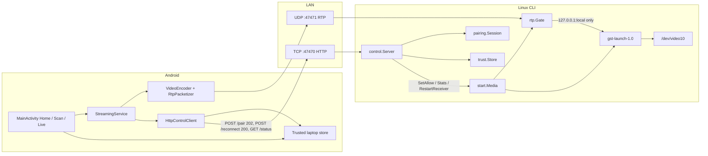
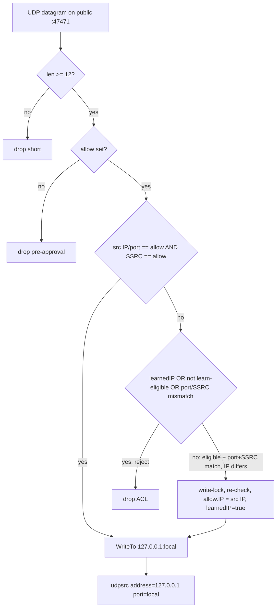
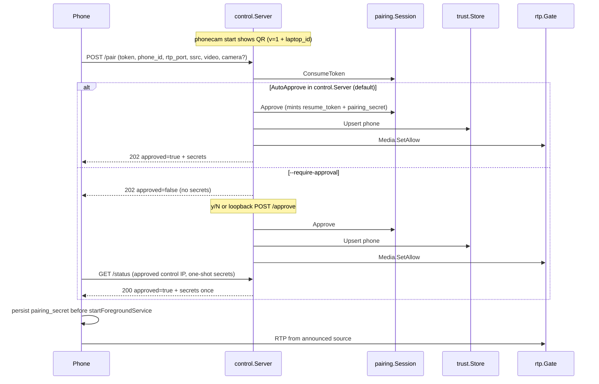
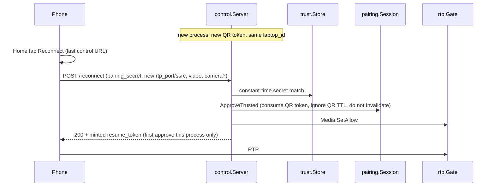
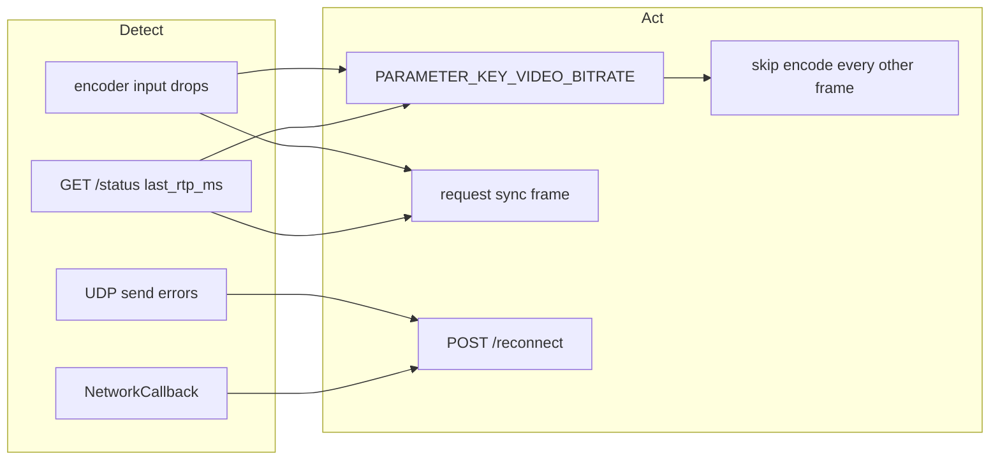

# PhoneCam v0.2 — Reliability And Controls

| Field | Value |
| --- | --- |
| Status | Proposed |
| Author | TBD |
| Date | 2026-08-17 (revised after design review) |
| Product | PhoneCam (Android → Linux virtual webcam) |
| Repo | https://github.com/kvm404/phonecam |
| Baseline | v0.1.0 shipped; `main` at the merge of PR #39 |
| Companion docs | `docs/ROADMAP.md`, `docs/TECHNICAL_DESIGN.md`, `docs/PRD.md` |
| Suggested landing path | `docs/v0.2-reliability-and-controls.md` (planning PR) |

## Overview

PhoneCam v0.1 is a working LAN webcam: CameraX → MediaCodec H.264 → RFC 6184 RTP/UDP → `gst-launch-1.0` → `v4l2loopback` `/dev/video10` (`card_label=PhoneCam`). Pairing is a 2-minute one-shot QR token. The meeting-breaking gaps are not capture quality — they are session brittleness. If the phone drops Wi-Fi, the stream dies and the user must rescan. If RTP fragments are lost, the picture freezes until the next forced IDR (~2 s). The pairing package already implements source IP/port/SSRC pinning (`BindRTPSource` / `ValidateRTPSource` in `linux-cli/internal/pairing/session.go`), but the live receiver never calls them: after approval, `udpsrc` accepts any UDP on the RTP port.

v0.2 makes an already-paired meeting survive Wi-Fi blips and a second session start without a new QR, without adding accounts, cloud relay, USB, torch, SRTP, or a latency lab. The design splits one overloaded roadmap line into five honest workstreams:

1. **RTP admission control** — actually enforce the v0.1 pinning contract via a userspace UDP gate (Go forwards packets; GStreamer still decodes).
2. **In-session auto-reconnect** — a `resume_token` minted at approval lets the same phone re-announce RTP identity after a network drop without rescanning.
3. **Persistent trusted pairing** — a long-lived `pairing_secret` stored on both sides lets the next `phonecam start` accept that phone without a new QR.
4. **Degraded-network behavior** — stay live under loss (drop late frames, shrink keyframes, request IDR) rather than freeze between GOPs.
5. **Controls that are not already shipped** — front/back flip and the 720p/540p/360p selector exist; v0.2 finishes robustness, bitrate-per-preset, and an optional 15 fps pre-session choice. Mid-stream renegotiation is explicitly out.

USB mode, torch, and a measurement harness are **deferred**, not cancelled. USB remains a v1.0 goal. Torch and latency tooling go to an unscheduled Later bucket.

## Background & Motivation

### Current pipeline (verified in code)

```text
Android                          LAN                    Linux
───────                          ───                    ─────
MainActivity (Home/Scan/Live)
  └─ quality chosen on Home
  └─ first valid QR → PairingController
       POST /pair + poll GET /status
StreamingService (camera FGS)
  CameraX ImageAnalysis KEEP_ONLY_LATEST
    → FrameConverter (center-crop)
    → rotate
    → CanvasComposer (fixed landscape canvas)
    → VideoEncoder (MediaCodec AVC)
    → RtpPacketizer (RFC 6184, FU-A, MTU 1200)
    → UdpRtpSender (pace 8 pkt / 1 ms)
         RTP/UDP ─────────────────► gst-launch-1.0
                                      udpsrc buffer-size=4MB
                                      rtpjitterbuffer latency=150 drop-on-latency=true
                                      rtph264depay ! h264parse ! avdec_h264
                                      videoconvert ! YUY2 WxH (fps NOT pinned)
                                      v4l2sink /dev/video10 sync=false
```

Control HTTP (`linux-cli/internal/control/server.go`) is request/response only:

| Method | Path | Binding | Role |
| --- | --- | --- | --- |
| `GET` | `/healthz` | LAN | liveness |
| `GET` | `/pairing` | **loopback only** | dump QR payload |
| `POST` | `/pair` | LAN | consume one-shot token |
| `POST` | `/approve` | **loopback only** | mark session approved |
| `GET` | `/status` | LAN | `{ok, approved, session}` |

There is no WebSocket, no health telemetry after pairing, no `/reconnect`, and no persistent laptop identity.

### Pain points this cycle exists to fix

1. **One-shot pairing is a meeting hazard.** `pairing.Session` (`linux-cli/internal/pairing/session.go`) mints a 256-bit token (`TokenBytes = 32`) with `DefaultTTL = 2 * time.Minute`, consumes it once (`ErrTokenConsumed`), and dies with the process. `StreamingService` is `START_NOT_STICKY`. After `PairingState.Paired`, the phone never talks HTTP again. A Wi-Fi roam that changes the phone's IP, or a UDP socket death, has no recovery path except Leave + rescan.

2. **Documented RTP pinning is not live.** `BindRTPSource` / `ValidateRTPSource` are implemented and covered by `TestRTPBindingRequiresApprovalAndValidatesSource` in `session_test.go`. `start.Runtime.Run` (`linux-cli/internal/start/start.go`) never calls them. After approval it launches `gstreamer.Runner` with `udpsrc port=<rtp>`. Anyone on the LAN who can send UDP to port 47471 can inject into the virtual camera.

3. **Loss freezes the GOP.** Vendor encoders do not honor `KEY_I_FRAME_INTERVAL` reliably, so `VideoEncoder.encode` forces a sync frame every `profile.fps * 2` frames. That is the only recovery from a shredded IDR. Bitrate is a constant `DEFAULT_BIT_RATE = 4_000_000` even for the 360p preset, so LOW still emits large keyframe bursts on weak Wi-Fi.

4. **Receiver death is process death.** If `gst-launch-1.0` exits, `start.Run` returns `gstreamer receiver exited unexpectedly` and tears down the control server. A decoder hiccup ends the meeting.

5. **Roadmap language is stale relative to `main`.** Front/back flip (`StreamingService.flipCamera`) and the High/Medium/Low selector (`StreamQuality` + Home `qualityToggleGroup`) already shipped. Designing them again would waste a cycle.

### What v0.1 already shipped (do not re-implement)

| Feature | Where | Status |
| --- | --- | --- |
| Front/back flip | `StreamingService.flipCamera()`; Live `flipCameraButton` | Shipped. Toggles `CameraSelector.DEFAULT_BACK_CAMERA` / `DEFAULT_FRONT_CAMERA` and rebinds. Encoder canvas is unchanged. |
| Resolution selector | `StreamQuality` HIGH/MEDIUM/LOW = 1280×720 / 960×540 / 640×360, all 30 fps; pref `stream_quality`; committed in `MainActivity.startPairing()` via `selectedQuality.toProfile()` | Shipped as a **pre-scan** control. Receiver sizes to phone-reported `video` (`TestRunStartsReceiverWithNegotiatedDimensions`). |
| Session-scoped QR pairing | `pairing.New` + `POST /pair` + `POST /approve` | Shipped. Auto-approve is the default; `--require-approval` restores y/N. |
| Persistent `phone_id` | `MainActivity.phoneIdentity` in SharedPreferences `"phonecam"` / `"phone_id"` | Shipped. Laptop identity is **not** persisted. |
| Late-frame drop on the phone | `ImageAnalysis.STRATEGY_KEEP_ONLY_LATEST`; encoder drops when `dequeueInputBuffer(0) < 0` | Shipped. |
| Forced IDR ~2 s | `VideoEncoder` `SYNC_REQUEST_INTERVAL_SECONDS = 2` | Shipped. |
| Jitterbuffer drop-on-latency | `pipeline.go` `DefaultJitterLatency = 150` | Shipped. |
| Stream survives screen off / activity death | `StreamingService` camera FGS + `WIFI_MODE_FULL_LOW_LATENCY` + `PARTIAL_WAKE_LOCK` | Shipped. |
| Cross-terminal status/stop | `$XDG_RUNTIME_DIR/phonecam/session.json` (`linux-cli/internal/session`) | Shipped. Runtime only; not a trust store. |

### Constraints that do not move

- Local-first: no accounts, no cloud relay.
- RTP/UDP stays **unencrypted**. Do not silently add SRTP.
- Do not weaken 256-bit tokens, loopback-only `GET /pairing`, or loopback-only `POST /approve`.
- Go CLI must not own the video decode hot path. Packet filter + forward is in bounds; `avdec_h264` stays in GStreamer.
- Planning PR before implementation (`CONTRIBUTING.md`: `plan/`, `feat/`, `fix/`, `docs/`, `chore/`; Conventional Commits; no direct merge to `main`).
- No new latency measurement harness. `docs/BENCHMARKS.md` stays a template.
- Do not restore `docs/HANDOFF_CLAUDE.md`.

## Goals & Non-Goals

### Goals

- Mid-meeting Wi-Fi drop or brief RTP silence recovers to a live picture **without a new QR scan**, typically within one keyframe interval after the network is back.
- A phone that completed a successful pair can start the next `phonecam start` session with one tap (Reconnect), no QR, on the same LAN.
- After approval, RTP that is not the pinned `(ip, port, ssrc)` is dropped. Packets before approval are dropped. The pin starts as the `/pair` HTTP peer + announced UDP port + SSRC. Exact `(ip,port,ssrc)` always forwards. A port+SSRC match from a **different** IP is eligible only after **1 s with zero forwards from the HTTP IP**; `SetAllow` resets that state (see Workstream A). The inner `udpsrc` binds `127.0.0.1` only.
- Weak Wi-Fi degrades to a live, blocky, or lower-bitrate picture instead of a multi-second freeze.
- `phonecam status` reports phone identity, negotiated video, last RTP age, reconnect readiness, and trusted-device count using the existing CLI/HTTP surfaces.
- Front/back flip and the three resolution presets remain the user-facing controls they already are; leftover work is robustness and bitrate/FPS, not a redesign.
- First implementation PR is docs-only and updates `docs/ROADMAP.md`, adds this document under `docs/`, and patches `docs/TECHNICAL_DESIGN.md` / `docs/PRD.md` only where they contradict the new scope.

### Non-goals (this cycle)

| Item | Disposition |
| --- | --- |
| USB / ADB transport | Deferred to **v1.0** (“Stable Wi-Fi and USB support”). |
| Torch toggle | **Later** / unscheduled. Not part of v0.3 desktop work. |
| Latency measurement harness | **Later**. Do not fill `docs/BENCHMARKS.md` with a lab. |
| `POST /telemetry` (battery/thermal/drops) | **Later** (decided 2026-08-17). Not in v0.2 PRs. |
| SRTP / DTLS / WebRTC | Out. LAN threat disclosure stays explicit. |
| Mid-stream resolution or canvas renegotiation | Out. Restarts `gst-launch` + `exclusive_caps=1` and drops meeting-app cameras. |
| WebSocket control plane | Out. HTTP + poll is enough. |
| mDNS / LAN scan / extra discovery protocols | Out of v0.2 (see Alternatives). Last-known control URL only. |
| Audio, tray, systemd user service | Still v0.3. |
| Multi-phone simultaneous streams | Out. One live phone per `phonecam start`. |
| Ultra-wide / tele camera catalog UI | Out. Front/back only (decided 2026-08-17). |
| Accounts, pairing via the public internet | Out. |
| Restoring `docs/HANDOFF_CLAUDE.md` | Out. |

### Success criteria (qualitative; no new harness)

These are acceptance checks for reviewers and manual QA, not a benchmark suite:

- Kill Wi-Fi on the phone for ~5 s during a live session, restore it: Live shows “Reconnecting…”, then REC, without returning to Home or scanning.
- `phonecam stop` && `phonecam start`, tap Reconnect on the phone: stream starts, QR is not required.
- From a third LAN host, send UDP to the advertised RTP port during an approved session: `v4l2sink` picture does not change; `phonecam status` counts dropped-unpinned packets.
- Switch Home quality to Low + 15 fps, Reconnect: laptop reports 640×360@15 and the picture stays live. Changing quality **during** REC is still impossible (selector is Home-only).
- Flip on a dual-camera phone still works. Flip on a single-camera phone does not crash the service.
- `go test ./...` and `go test -race ./...` in `linux-cli/`; `JAVA_HOME=/usr/lib/jvm/java-17-openjdk ./gradlew testDebugUnitTest` in `android/`.

## Proposed Design

### Architecture after v0.2



The only new hop on the media path is a userspace UDP forwarder on the laptop. It does not decode, depayload, or buffer frames. GStreamer remains the decoder. `control.Server` never owns `gst-launch`; it talks to a `Media` interface implemented by `start.Runtime`.

### Workstream A — RTP admission gate (makes v0.1’s security contract real)

#### Why a gate, not `udpsrc` properties

`gstreamer.PipelineArgs` builds a `gst-launch-1.0` argv. `udpsrc` can bind an interface (`address=`) but cannot ACL a remote `(ip, port)` or SSRC. Putting an ACL in GStreamer would require `rtpbin` + a custom element or abandoning `gst-launch` for a C/Go appsrc pipeline that **does** own depayload — which violates “Go does not decode.”

A 12-byte RTP header parse + `WriteTo` to localhost is not decode. At 4 Mbps / ~400–800 pps it is noise on a midrange laptop.

#### Placement

New package `linux-cli/internal/rtp` (name `rtp`, type `Gate`):

```go
package rtp

const PublicRcvbuf = 4194304 // same number as pipeline.go udpsrc buffer-size

type Stats struct {
    Received     uint64
    Forwarded    uint64
    DroppedACL   uint64
    DroppedShort uint64
    LastPacket   time.Time
    LearnedIP    bool // true after a delayed IP learn for this SetAllow (see below)
}

type Gate struct {
    // Public conn: 0.0.0.0:<publicPort> (default 47471), SO_RCVBUF=PublicRcvbuf.
    // Forward dest: 127.0.0.1:<localPort>. gst udpsrc binds that tuple only.
}

func NewGate(publicPort int) (*Gate, error) // 0 → ListenPacket("udp", "0.0.0.0:0")
func (g *Gate) LocalRTPPort() int               // 127.0.0.1 port for PipelineArgs
func (g *Gate) PublicRTPPort() int              // advertised in the QR; the bound public port
func (g *Gate) SetAllow(src pairing.RTPSource)  // zero IP → drop all; always resets learnedIP
func (g *Gate) Stats() Stats                    // safe to call from /status
func (g *Gate) Run(ctx context.Context) error
```

`publicPort == 0` means ephemeral: `ListenPacket("udp", "0.0.0.0:0")`, keep that conn, advertise `PublicRTPPort()` (the kernel-assigned port) in the QR / `session.Record`. This matches today’s `--rtp-port 0` and the `start` tests that pass `RTPPort: 0`. `pairing.New` still receives that resolved public port, not 0.

`SetAllow` vs the recv loop share one `sync.RWMutex`. **`SetAllow` always takes the write lock and atomically replaces the allow tuple and sets `learnedIP=false`** (and clears the “HTTP-IP has forwarded” / `learnEligibleAt` state below). A roam `/reconnect` that calls `SetAllow` with a new HTTP IP + new port/SSRC must be able to learn again; a sticky `learnedIP` would ACL-drop a dual-iface phone until process restart.

The recv loop copies the tuple under the read lock per packet. It **must not try to upgrade** the `RWMutex`. To learn: drop the read lock, take the write lock, **re-check** (`!learnedIP`, port+SSRC still match, still learn-eligible), then mutate. Counters are `atomic.Uint64`. `LastPacket` is stored as `atomic.Int64` unix-nanos. `Stats()` must be safe to call from `GET /status` on the HTTP goroutine.

##### Choosing `LocalRTPPort()` without a silent bind/close race

Do **not** bind the public port, close it, and hope `gst-launch` wins the same number (that is today’s ephemeral-RTP trick and is the wrong socket after the gate exists).

1. `NewGate` `ListenPacket("udp", "0.0.0.0:<publicPort>")` (`:0` when `publicPort == 0`) and **keeps** that conn. This is the only LAN-reachable RTP socket.
2. Call `SetsockoptInt(SOL_SOCKET, SO_RCVBUF, PublicRcvbuf)` on that conn **before** `Run`. Linux may silently cap at `net.core.rmem_max`. **`doctor` is a separate process and cannot see the live gate fd.** It opens a **throwaway** UDP socket, `SetsockoptInt` 4 MB, `GetsockoptInt`, and WARNs using `min(got, got/2) < PublicRcvbuf`. It must not require `phonecam start` to be running. The 4 MB knob that exists to absorb IDR bursts (`pipeline.go` comments) must live on the **public** Go socket. The inner localhost `udpsrc buffer-size=4194304` may stay; it is not the one that can drop on the LAN.
3. Allocate the inner port by `ListenPacket("udp", "127.0.0.1:0")`, read `LocalAddr().(*net.UDPAddr).Port`, **close** that probe, store the number as `localPort`. Then start `gst-launch` with `udpsrc address=127.0.0.1 port=<localPort>`. If `receiver.Run` returns a bind error within 500 ms, retry the probe+launch up to 5 times. Do not reuse a port that just failed.
4. The gate forwards with `WriteTo(pkt, &net.UDPAddr{IP: net.IPv4(127,0,0,1), Port: localPort})`.

The GStreamer property that actually binds loopback on this host (`gst-inspect-1.0` 1.28.5) is **`address=`**, not `bind-address=` (that property does not exist and errors). `PipelineArgs` **must** emit `address=127.0.0.1`. A unit test must `strings.Contains` that exact token. A gate test must show that a datagram sourced from a non-loopback address and aimed at `localPort` is **not** a success path: the inner socket is not LAN-reachable because it is bound to `127.0.0.1`.

##### Packet path and delayed IP learn



SSRC is RTP header bytes 8–11, big-endian. Sequence numbers are not interpreted.

PR 2 is **not** behavior-neutral for every phone that works on `main` today. `pendingSource.IP` is the HTTP peer from `ConsumeToken` (`control.handlePair` → `remoteIP(r.RemoteAddr)`), not a learned UDP source. A phone whose TCP and UDP leave via different addresses (VPN, dual-Wi-Fi, IPv4-mapped weirdness) streams on `main` only because `udpsrc` is open and `start.Run` never calls `BindRTPSource`. Hard-failing those setups with no diagnosis is unacceptable.

v0.2 therefore **may learn the IP once per `SetAllow`**, with two rules that keep a well-behaved single-iface phone winning:

1. **Exact `(ip, port, ssrc)` always forwards** and marks “HTTP-IP has forwarded.”
2. **Learn is delayed.** A port+SSRC match from a *different* IP is eligible only after the HTTP-IP pin has produced **zero forwards for 1 s** after `SetAllow` (`learnEligibleAt = setAllowTime + 1s`, and no packet has been forwarded from the HTTP IP). On a normal LAN the real phone’s first packets win and `learnedIP` stays false. Dual-iface phones that never match the HTTP IP become eligible at T+1s.

After a successful learn, the pin is frozen until the next `SetAllow`. Port and SSRC stay as announced.

**Residual accepted risk (document in the threat table, do not pretend it is closed):** `rtp_port` and `ssrc` are in the cleartext `POST /pair` JSON. An attacker who sniffs `/pair` **and binds the announced source port** can still win the first-packet race once learn is eligible. That is the same class as LAN HTTP MitM / RTP sniff, not a new authority. It is better than today’s open `udpsrc`, and it is not “first packet with this SSRC from any port.” Do not add `--insecure-open-rtp` to paper over it.

`packets_dropped_acl` and `last_rtp_ms` are **mandatory** in PR 2 and must appear on `GET /status` and `phonecam status`. A black `v4l2sink` after the gate ships has to be diagnosable (`RTP: silent, 0 fwd, 412 acl drops`) without a debug build.

There is **no** `--insecure-open-rtp`. Re-opening `udpsrc` on `0.0.0.0` is the bug. Dual-iface is handled by the IP learn; remaining failures roll back the CLI binary.

#### Session API the gate actually calls

Today `BindRTPSource` requires `sameRTPSource(pendingSource, source)` and rejects a second bind with `ErrAlreadyBound`. That first-bind check stays. v0.2 adds the methods in the state machine below (Workstream B/C). After a successful `ApprovePending()` or `ApproveTrusted()`:

1. `src, ok := pairSession.ApprovedSource()` — must be true.
2. `pairSession.BindRTPSource(src)` — **bind if unbound; if already bound to the same source, return nil** (so `/reconnect` racing the wait-loop exit is not `ErrAlreadyBound`). A different already-bound source is `RebindRTPSource`’s job, not `BindRTPSource`.
3. `media.SetAllow(src)` (which is `gate.SetAllow`).
4. Start `receiver.Run` with `RTPPort: gate.LocalRTPPort()` (the **inner** port, not the public QR port) and the negotiated `Width`/`Height` (fps still unpinned in caps).

`TestRunPrintsPairingPayloadAndStopsOnContextCancel` today asserts `config.RTPPort == 50123` on the **receiver** (`linux-cli/internal/start/start_test.go`). That is the public port today. PR 2 **must** change that test: the QR / `session.Record` RTP port stays `50123`; `receiver` `Config.RTPPort` equals `gate.LocalRTPPort()` and must **not** equal `50123`.

Until step 3, the gate drops everything — this is the missing “RTP packets received before approval are ignored” from `docs/TECHNICAL_DESIGN.md`. Create the `Gate` **before** `http.Server.Serve` so the drop-all window covers the whole pairing wait.

#### What does **not** change in GStreamer (except bind address)

Keep inner `buffer-size=4194304`, `latency=150`, `drop-on-latency=true`, `sync=false`, YUY2 WxH, no framerate in caps. The comments in `pipeline.go` about IDR bursts remain valid but now apply to the **public** Go socket (Workstream A rcvbuf) as well as the inner `udpsrc`.

Required argv change in PR 2:

```text
udpsrc address=127.0.0.1 port=<local> buffer-size=4194304 caps=…
```

Small, safe addition (Workstream D / PR 7): `h264parse config-interval=-1` so SPS/PPS are repeated even if a mid-GOP joiner missed the phone’s pre-IDR repeat. The test sender already uses `rtph264pay config-interval=1` (`linux-cli/internal/gstreamer/sender.go`); the receiver parse side should match. Do **not** add `config-interval` in PR 2 — keep that PR reviewable.

### Session state machine (Workstreams A–C share this)

`pairing.Session` today cannot implement trusted reconnect. Literal `Invalidate()` sets `invalidated=true`, `approved=false`, `rtpSource=nil`. Existing `Approve()` returns `ErrInvalidToken` if `!consumed`, `ErrNoPendingPhone` if `pendingSource.IP == nil`, and `ErrExpired` if `isExpiredLocked(now)` — so a fresh `phonecam start` whose 2-minute QR token has expired (the common “start CLI, pick up phone later” case) cannot be approved by any reuse of `Approve()`. “Install approved phone” is not an API. Specify these five operations and do not invent a sixth (`TakeOver` is **out** of v0.2):

| Op | When | QR expiry | Sets |
| --- | --- | --- | --- |
| `ConsumeToken` (existing) | First QR `/pair` | Consulted | `consumed`, `pendingPhone`, `pendingSource`, optional `negotiated` |
| `Approve()` (existing, aka `ApprovePending`) | After `ConsumeToken`, QR or `--require-approval` / auto-approve | Consulted | `approved`, `approvedPhone`, mints `resume_token` + optional `pairing_secret` |
| **`ApproveTrusted(phone, source, video)`** (new, PR 6) | `POST /reconnect` with a valid `pairing_secret` when **this process has no approved phone yet** | **Not consulted** | `consumed=true` (leftover QR → `ErrTokenConsumed`), `approved=true`, `approvedPhone`, `negotiated`, `pendingSource` **and** `rtpSource` = `source`, **new** `resume_token`. Does **not** call `Invalidate()`. Does **not** rotate `pairing_secret`. Does **not** leave a `PendingPhone()` (consumed∧approved ⇒ `PendingPhone` is false). If `IsApproved()` and `approvedPhone.ID != phone.ID` → **`ErrDifferentPhone`** (HTTP 409). If `IsApproved()` and same `phone.id` → equivalent to `RebindRTPSource` (**echo** the existing `resume_token`; do not mint or rotate). |
| **`RebindRTPSource(source)`** (new, PR 4) | In-session `/reconnect` with `resume_token` | n/a | Requires `approved && !invalidated`. Replaces `pendingSource` and `rtpSource`. Same `phone.id` only. |
| `Invalidate()` (existing) | `phonecam stop` / process teardown **only** | n/a | Dead session. Never used to “clear” an unused QR so trusted reconnect can proceed. |

`BindRTPSource` (existing) is **first bind or same-source idempotent**: if unbound, pin if `sameRTPSource(pendingSource, source)`; if already bound to that source, return nil; if already bound to a different source, return `ErrAlreadyBound` (caller must `RebindRTPSource`). This is what stops `/reconnect` racing the `start.Run` wait-loop exit.

`start.Run` wait loop (`for !pairSession.IsApproved()`) already exits on `IsApproved()` without going through `PendingPhone()`. `ApproveTrusted` must set `IsApproved()` in the same critical section as `consumed=true` so `--require-approval` never flashes y/N for a trusted phone. Auto-approve in v0.2 moves **into** `control.Server` (see secret delivery); the wait loop still works as a backstop for `--require-approval` stdin / loopback `POST /approve`.

Export:

```go
func (s *Session) ApproveTrusted(phone Phone, source RTPSource, video *VideoProfile) error
func (s *Session) RebindRTPSource(source RTPSource) error
func (s *Session) ApprovedSource() (RTPSource, bool)
// ErrDifferentPhone: ApproveTrusted when another phone.id is already approved (HTTP 409).
func (s *Session) BoundSource() (RTPSource, bool)
func (s *Session) TakeSecrets() (resume, pairing string, ok bool) // one-shot; see secret delivery
```

### Workstream B — Auto-reconnect (in-session)

This is the meeting-saving feature. It does **not** require disk persistence.

#### Two credentials, two lifetimes

| Credential | Entropy | Issued | Lives until | Purpose |
| --- | --- | --- | --- | --- |
| QR `token` | 256-bit | `pairing.New` | 2 minutes or first consume | Physical-proximity bootstrap (unchanged) |
| `resume_token` | 256-bit | `Approve()` | `Invalidate()` / process exit | Re-announce RTP identity after a drop, same `phonecam start` |
| `pairing_secret` | 256-bit | first successful approve, written to trust store | explicit revoke | Next `phonecam start` without QR (Workstream C) |

The QR token stays one-shot. Reconnect must not revive it (`ErrTokenConsumed` stays).

`Approve()` mints `resume_token` (and, if a trust store is configured, `pairing_secret`). Neither value is placed in `Payload()` / `PayloadJSON()`, so it cannot leak through the terminal QR dump or `GET /pairing`.

#### Secret delivery (one rule; do not invent a second channel)

`GET /status` is unauthenticated on the LAN. `lifecycle.Manager` already probes `http://127.0.0.1:<port>/status` as the PID-reuse guard. Putting `resume_token` on every approved-IP `/status` would (a) hand a process-lifetime credential to whoever next gets that DHCP lease and (b) tempt implementers to “also allow loopback,” which would leak secrets to `phonecam status`.

**Do not key long-lived authority on a DHCP address.** Deliver secrets on mutating endpoints; use `/status` as a one-shot fallback only for `--require-approval`.

Production today never returns `approved=true` from `POST /pair`. `control.handlePair` only `ConsumeToken`s, then writes `Approved: s.session.IsApproved()` — always false (`TestPairConsumesTokenAndWaitsForApproval`). Auto-approve lives in `start.Runtime.Run` *after* the 202 has been sent, on the `PendingPhone()` poll (`approvalPollInterval = 200ms`). `HttpControlClient.pair` accepts **HTTP 202 only** and parses only `approved` + `session`. `PairingState.Paired` holds only `PairingPayload`. `StreamingSession` holds only `payload` / `rtpIdentity` / `profile`. A 200 on `/pair` would be `PairResult.Failure` on the current client.

v0.2 therefore:

1. **Move `AutoApprove` into `control.Server`.** `control.Config.AutoApprove bool`. `handlePair` after a successful `ConsumeToken` calls `Approve()` when `AutoApprove` is set, then writes the 202. `TestPairConsumesTokenAndWaitsForApproval` stays (that test does not set `AutoApprove`). Add `TestPairAutoApproveReturnsSecretsOn202`.
2. **`POST /pair` is HTTP 202 forever.** Never 200. Auto-approve 202 body: `{ok, approved:true, session, resume_token, pairing_secret}`. Require-approval 202 body: `{ok, approved:false, session}` — no secrets.
3. **`POST /reconnect` is HTTP 200 only.** Body **echoes the live** `resume_token`. Do not mint or rotate it here — that would 401 a phone retrying with the value it already stored. A **new process** `ApproveTrusted` (no phone approved yet) is the only reconnect path that mints a token; the old process’s token is already dead. Later `/reconnect`s, including same-id rebind, echo that live token.
4. **`GET /status` is not a secret oracle.** Default body has **no** `resume_token` / `pairing_secret`. Loopback `/status` **never** includes secrets (`lifecycle.Manager` must not be treated as the phone). The single exception: `--require-approval`, after `Approve()`, the next `GET /status` from the **approved control IP** may include each secret **once** (`TakeSecrets()` clears them). After that, `/status` is telemetry only. Prefer (2) and (3); this exception exists because the QR token is already consumed so the phone cannot `POST /pair` again.
5. **Thread credentials through the Android types that actually own them** (today’s change map omitted these):
   - `PairResult.Accepted` grows optional `resumeToken` / `pairingSecret`.
   - `StatusResult.Ok` grows the same optional fields (one-shot `/status` path).
   - `PairingState.Paired` becomes `data class Paired(val payload: PairingPayload, val resumeToken: String, val pairingSecret: String?)`.
   - `StreamingSession` / `onPaired()` copy those fields. Persist `pairing_secret` to `trusted_laptops` **before** `startForegroundService`.
   - `PairingController` + `PairingControllerTest` must cover the `approved=true` short-circuit **and** the poll path that reads secrets off one `/status` 200. There is today no test for the `approved=true` short-circuit.
6. `HttpControlClient.pair` keeps treating non-202 as `Failure`. Extra response keys stay ignored (`JSONObject.opt*`). Add a client test that 200 on `/pair` is still a failure (v0.1 contract) and that extra keys on a 202 do not break parse.

#### New endpoint: `POST /reconnect`

```http
POST /reconnect
Content-Type: application/json

{
  "phone": {"id": "…", "name": "I2404"},
  "rtp_port": 50123,
  "ssrc": 3891274123,
  "video": {"width": 1280, "height": 720, "fps": 30},
  "resume_token": "…",        // in-session, preferred
  "pairing_secret": "…",      // cross-session, Workstream C
  "camera": "back"            // optional; echoed on GET /status
}
```

Auth (constant-time compare, either credential is sufficient):

1. If `resume_token` matches the live session → accept. Session id is implied. Then `RebindRTPSource`.
2. Else if `pairing_secret` matches a trusted `phone.id` **and no other phone is approved** → `ApproveTrusted` (even if the QR token is unused or past `DefaultTTL`). If another `phone.id` is already approved → 409. Same `phone.id` already approved → rebind.
3. Else 401. Do not distinguish “bad token” vs “unknown phone” in the error string.

Authorization policy (still **one** live stream, not multi-phone). **v0.2 does not implement cross-phone takeover.** Five seconds of silence is shorter than the reconnect backoff (0.5…8 s); a second trusted phone (the store holds up to 8) would steal the meeting while phone A is mid-blip, and A’s next `/reconnect` with `resume_token` would have no specified outcome. That is worse than making B wait for `phonecam stop` / `trust revoke`.

- Same `phone.id` **always** replaces the RTP pin (`RebindRTPSource`, or `ApproveTrusted` when this process has no approved phone yet, or `ApproveTrusted` same-id after already approved → rebind).
- Different `phone.id` while **any** phone is approved → **409** (`ErrDifferentPhone`). No grace, no silence timer, no `TakeOver`. B’s Home Reconnect shows “PhoneCam is in use — stop it on the laptop or revoke the other phone.”
- A’s `resume_token` stays valid across A’s own rebinds. It is not rotated out from under A by B.
- Trusted reconnect while the QR token is still unused and **no** phone is approved → `ApproveTrusted` (marks the QR token **consumed**, does **not** call `Invalidate()`). A leftover QR on screen then gets `ErrTokenConsumed` / HTTP 401, not a second live phone.
- `--require-approval` still prompts for **new** QR phones. Trusted / resume reconnects do not prompt (`ApproveTrusted` never produces `PendingPhone()`).

On success (**HTTP 200 only**, never 202):

```json
{
  "ok": true,
  "approved": true,
  "session": "…",
  "resume_token": "…",
  "control": "http://192.168.1.42:47470",
  "rtp": "192.168.1.42:47471",
  "video": {"width": 1280, "height": 720, "fps": 30}
}
```

The HTTP handler does **not** touch `gst-launch` or the gate directly. `control.New` today takes only `Session` + `Clock`. v0.2 extends `control.Config` with a `Media` interface **owned by `start.Runtime`**:

```go
type Media interface {
    SetAllow(src pairing.RTPSource)
    Stats() rtp.Stats
    RestartReceiver(video pairing.VideoProfile) error
}

type Config struct {
    Session     *pairing.Session
    Clock       Clock
    Media       Media          // required once the gate exists (PR 2)
    AutoApprove bool           // PR 4 moves auto-approve into handlePair
    Trust       TrustStore     // PR 6; nil means --no-trust
}
```

`handleReconnect` / `handlePair` (auto-approve) call, in order: session mutation (`Approve` / `ApproveTrusted` / `RebindRTPSource`) → `Media.SetAllow` → `Media.RestartReceiver(negotiated)`. FPS-only changes never restart (framerate is not in caps). A WxH restart of an **already running** pipeline is a brief black frame; acceptable on a quality change between sessions, rare mid-meeting.

**`RestartReceiver` must not start the first `gst-launch`.** Auto-approve `/pair` and Home Reconnect `ApproveTrusted` both run **while `start.Run` is still in `for !pairSession.IsApproved()`** — `receiver.Run` has not been called. Today `start.Run` is the only place that starts the receiver (`linux-cli/internal/start/start.go` after the approval loop). Contract:

| Supervisor state | WxH vs last/stored | `RestartReceiver` |
| --- | --- | --- |
| Never started a receiver | any | Store `video` as the pending profile; **return nil**. Do not call `gst-launch`. |
| Receiver running | same WxH | Return nil. |
| Receiver running | WxH changed | Signal the existing supervisor to stop/start with the new caps. |
| Receiver running, supervisor nil (should not happen after PR 3) | — | Return an error; do **not** spawn a second pipeline. |

After the handler returns, the wait loop exits and `start.Run` is the **unique first start**: `BindRTPSource` + `SetAllow` + `receiver.Run` using `NegotiatedVideo()` (which already includes the profile `RestartReceiver` stored, or the `/pair` body). Required test: `/pair` auto-approve with 640×360 **before** `receiver.Run` has been entered does not invoke `gst-launch` twice and does not fail the 202.

`Gate` is created **before** `Serve` so pre-approval packets are dropped. The gst supervisor lives in `start`, not in the HTTP handler. `SetAllow` is the gate’s own mutex (already specified).

Rate limit: 5 requests / second / source IP and 20 / minute / `phone.id`, in-memory, on the control server. Fail closed with 429.

#### Receiver supervision (own PR; does not need `/reconnect`)

Replace the “any `receiver.Run` return is fatal” select in `start.Run` (`gstreamer receiver exited unexpectedly`) with a supervisor **in `start.Runtime`**:

- `gst-launch` crash → log last stderr via a new exported `Runner.LastOutput() (stdout, stderr string)` (today `execCommand` is unexported and stderr is only folded into `error.Error()`; do not scrape the error string). Restart after 250 ms, 1 s, 2 s, cap 2 s. Surface `receiver_restarts` in `/status`.
- `ctx` cancel / `phonecam stop` → stop restarting, `Invalidate()`, close gate.
- Do **not** treat RTP silence as a crash. `udpsrc` already blocks forever; the gate just forwards nothing.

This can land with or immediately after PR 2. It does not depend on `resume_token`.

#### Android in-session reconnect

`PairingController` is the wrong owner: it is launched from `MainActivity` and ends at `Paired`. Reconnect must run while the screen is off, so it belongs in `StreamingService`.

New pure-Kotlin `ReconnectController` (JVM-testable, same style as `PairingController`):

```kotlin
sealed interface StreamHealth {
    data object Live : StreamHealth
    data class Reconnecting(val attempt: Int) : StreamHealth
    data class Failed(val message: String) : StreamHealth
}

class ReconnectController(
    private val client: ControlClient, // extend with reconnect()
    private val creds: SessionCredentials,
    private val clock: () -> Long,
)
```

`StreamingService` keeps `SessionCredentials` (payload, resume token, pairing secret, committed profile) after handoff — extend `StreamingSession` rather than inventing a second singleton.

##### Types that must change (today they cannot keep MediaCodec running)

`VideoEncoder` takes `packetizer` and `sender` as constructor `private val`s. SSRC lives on `RtpPacketizer`. `UdpRtpSender` has immutable `socket` and `target`. `drainOutput` wraps `sender.send(...)` in a catch that sets `running = false` and calls `onError` → `StreamingService.stopStreaming`. A throw does not start reconnect; it kills the meeting. `DatagramSocket.send` often **does not throw** on Wi-Fi loss (the datagram is accepted locally), so send-throw is **best-effort**, not a primary trigger.

Specify a replaceable send path without `stop`/`configure`/`start`:

```kotlin
class UdpRtpSender(...) : RtpSender {
    @Synchronized fun setSocket(socket: DatagramSocket)
    @Synchronized fun setTarget(target: InetSocketAddress)
    // send() must not throw out of drainOutput: log + increment sendFailures
}

class VideoEncoder(...) {
    fun requestSyncFrame()          // PARAMETER_KEY_REQUEST_SYNC_FRAME; today's counter is private
    fun replaceRtpIdentity(id: RtpIdentity)  // swap SSRC/seq; MUST keep SPS/PPS cache
    fun sendFailures(): Int
}
```

`replaceRtpIdentity` must **not** drop the SPS/PPS cache. Current `RtpPacketizer` caches parameter sets from the one-time `BUFFER_FLAG_CODEC_CONFIG` buffer and re-emits them before every IDR. MediaCodec will not emit another codec-config on `PARAMETER_KEY_REQUEST_SYNC_FRAME`. A brand-new packetizer would send the first post-reconnect IDR without SPS/PPS; `h264parse config-interval=-1` cannot invent sets it has never seen — that is the freeze reconnect is supposed to avoid.

Required behavior:

- Keep the cache on `VideoEncoder` (or copy `cachedSps`/`cachedPps` onto the new `RtpPacketizer` via `cacheParameterSets` / a package-visible copy).
- New SSRC + fresh random sequence number only.
- Swap on the encoder-output thread (or under the same lock `drainOutput` uses). Codec, canvas, and CameraX stay up.
- JVM test: after `replaceRtpIdentity`, the next IDR still emits SPS+PPS as single-NAL packets before the slice. Keep the immediate `requestSyncFrame()`.

##### Triggers and single-flight

`ReconnectController.start()` is **single-flight**: one `Mutex` / `AtomicBoolean`. `NetworkCallback`, send-failure, and the 2 s watchdog all call `start()`; a second call while a loop is running is a no-op.

Primary triggers (sufficient):

1. `ConnectivityManager.registerNetworkCallback` with a `NetworkRequest.Builder().addTransportType(TRANSPORT_WIFI)` (optionally `.addCapability(NET_CAPABILITY_NOT_VPN)`). **Do not** use `registerDefaultNetworkCallback` — that fires `onAvailable` on LTE after Wi-Fi dies, and `POST /reconnect` to `http://192.168.x.x:47470` then fails or leaves the LAN. Cellular `onAvailable` is not success. Requires `ACCESS_NETWORK_STATE` (not in the manifest today; `INTERNET` + `ACCESS_WIFI_STATE` are).
2. Watchdog: every 2 s `GET /status`. Failure to reach the laptop, or `approved=false` / session mismatch, starts reconnect. `request_keyframe=true` calls `VideoEncoder.requestSyncFrame()` without tearing down. **The HTTP watchdog is the source of truth for “laptop reachable.”**

Best-effort: `UdpRtpSender` send failures increment a counter the watchdog reads. They must **not** call `onError`.

Backoff: 0.5 s, 1 s, 2 s, 4 s, 8 s, then 8 s. Give up and call `stopStreaming("lost laptop — rescan or tap Reconnect")` after **60 s of failed attempts while `TRANSPORT_WIFI` is available**, not 60 s of wall-clock from first `onLost`. A 70 s Wi-Fi outage must not burn the give-up timer; when Wi-Fi returns, the 60 s window starts (or resets) with the next attempt. The camera FGS + existing `WAKE_LOCK_TIMEOUT_MS = 12h` is enough; do not add a new wake-lock policy.

On each attempt:

1. Keep CameraX + MediaCodec running if they are healthy (avoid a 300–800 ms camera rebind in the middle of a 2 s blip).
2. If the `DatagramSocket` is closed, `RtpIdentity.create()` a new one (new source port + new SSRC — this is why the laptop must `RebindRTPSource`, not just wait) and `videoEncoder.replaceRtpIdentity(...)`.
3. `POST /reconnect` (**expect HTTP 200**) with the new `rtp_port` / `ssrc`, current canvas `VideoProfile`, optional `camera`, and **every credential the phone still holds**: `resume_token` if present **and** `pairing_secret` if present. A laptop `stop`/`start` mid-meeting is exactly the session-mismatch the 2 s watchdog treats as reconnect; sending only the dead `resume_token` 401s for 60 s and dumps the user to Home. Laptop still prefers a matching `resume_token`, then `pairing_secret` → `ApproveTrusted`. Required controller test: session-id mismatch + stored secret → `ApproveTrusted` path, Live stays up.
4. `UdpRtpSender.setSocket` / `setTarget` from the response’s `rtp`. Keep the echoed `resume_token` (same value as sent, except a new-process `ApproveTrusted` which mints one).
5. `VideoEncoder.requestSyncFrame()` immediately so the first GOP after the hole is decodable.
6. Notify the bound activity: Live status text = “Reconnecting to {name}…” (`liveRecBadge` hidden, leave button stays). Success restores REC.

Do not return to Home on a blip. `onStreamingStopped` remains for Leave, notification Stop, and terminal encoder/camera failures (not send errors).

`HttpControlClient` timeouts stay 3 s (`connectTimeoutMs` / `readTimeoutMs`). Reconnect uses the same client. `reconnect()` accepts 200 only; extra keys ignored; non-200 is `ReconnectResult.Failure`.

### Workstream C — Persistent trusted device pairing

v0.1 is explicit: “No persistent trusted devices in v0.1” (`docs/TECHNICAL_DESIGN.md`). v0.2 flips that goal and nothing else about the threat model.

#### First pair (unchanged UX, extra write)



#### Next session (no QR)



If the last-known control URL fails (laptop DHCP change, different SSID), the phone stays on Home with “Can’t reach {name} — scan the QR”. Scanning a new QR for the same `laptop_id` **replaces** the stored secret (laptop also rotates the secret on that approve). No LAN scan, no mDNS in v0.2.

#### Laptop store

New package `linux-cli/internal/trust`.

Path: `$XDG_CONFIG_HOME/phonecam/trusted.json`, fallback `~/.config/phonecam/trusted.json`. **Not** `$XDG_RUNTIME_DIR` (that is the ephemeral `session.json` used by status/stop). Create dir `0700`, file `0600`.

```json
{
  "version": 1,
  "laptop_id": "base64url-16-bytes",
  "phones": [
    {
      "id": "uuid-from-phone",
      "name": "I2404",
      "secret": "base64url-32-bytes",
      "created_at": "2026-08-17T12:00:00Z",
      "last_seen": "2026-08-17T13:10:00Z"
    }
  ]
}
```

`laptop_id` is minted once, stable across `phonecam start` invocations, and added to the QR payload as `"laptop_id"` (protocol `v` stays **1**; Android `PairingPayload.parse` already ignores unknown keys). New app versions persist it; old APKs ignore it and still pair.

Cap: 8 phones. Insert beyond cap evicts the least-recently-`last_seen` and prints a one-line warning. One stream at a time still applies. There is **no unused-expiry**: `last_seen` is diagnostic only; entries stay until `phonecam trust revoke` / Forget (decided 2026-08-17).

`phonecam start` prints a one-line “Trusted phones can tap Reconnect” hint **only when `len(phones) > 0`**. Do not print it on an empty store.

#### Android store

Same SharedPreferences file `"phonecam"` already used for `phone_id`, `stream_quality`, `preview_visible`:

```text
trusted_laptops = JSON array of
  { laptop_id, name, control, rtp, secret, last_seen }
```

Do not add EncryptedSharedPreferences this cycle (new dependency, keystore edge cases). The secret is equivalent in exposure to unencrypted RTP on the same LAN; disk encryption of the phone is the real bound. `android:allowBackup="false"` is already set.

Home UI:

- If `trusted_laptops` is non-empty, show a primary **Reconnect to {name}** button above Scan QR.
- Long-press (or a small “Forget” affordance) deletes that entry locally. Copy: **“Forget on this device only — run `phonecam trust revoke` on the laptop to bar this phone.”** It does not call the laptop; the next Reconnect from this phone will 401 until the user scans again. A stolen/unlocked phone that still has `trusted_laptops` can still `POST /reconnect` from the victim LAN until laptop revoke (see Security).
- Multiple laptops: list, last-used first. No auto-start on app launch (camera FGS must start while visible; surprising auto-connect is worse than one tap).

#### CLI

```text
phonecam trust list
phonecam trust revoke <phone-id-or-name>
phonecam trust revoke-all
```

`phonecam start --no-trust` skips reading/writing the store for that process (CI, shared demo laptop). It does **not** delete the file.

Loopback-only HTTP mirrors, for automation:

- `GET /trust` → list `{id, name, created_at, last_seen}` (**no secrets**)
- `DELETE /trust/{id}` → revoke

Non-loopback → 403, same helper as `isLoopbackRequest`.

#### QR / protocol compatibility

| Client | Server | Behavior |
| --- | --- | --- |
| v0.1 APK | v0.2 CLI | QR pair works. Extra JSON fields on `/pair` 202 ignored by current `HttpControlClient` (it only reads `approved` + `session`). No Reconnect button. |
| v0.2 APK | v0.1 CLI | QR pair works. `POST /reconnect` → connection error / non-200 → “scan the QR”. |
| v0.2 | v0.2 | Full path. |

Do not bump `pairing.ProtocolVersion` / `PairingPayload.PROTOCOL_VERSION`. A bump would brick mixed-version pairs for no benefit.

### Workstream D — Degraded-network behavior

Goal: **stay live**. Not: measure glass-to-browser ms (harness deferred). Not: add retransmission (NACK/RTX adds delay and a second datagram path).

The freeze users see is almost always “IDR fragments were dropped, decoder holds the last picture until the next IDR.” v0.1 already attacks this with pacing, a 4 MB UDP rcvbuf, a 150 ms drop-on-latency jitterbuffer, and a 2 s sync request. v0.2 adds a feedback loop and smaller keyframes.



#### Sender: bitrate table (owned by PR 7; Workstream F only adds the 15 fps Home toggle)

`VideoEncoder.DEFAULT_BIT_RATE = 4_000_000` is wrong for 360p and is the cheapest win for weak Wi-Fi. Make bitrate a function of the committed profile:

| Preset | Canvas | FPS | Target bitrate |
| --- | --- | --- | --- |
| HIGH | 1280×720 | 30 | 4.0 Mbps |
| HIGH | 1280×720 | 15 | 2.5 Mbps |
| MEDIUM | 960×540 | 30 | 2.5 Mbps |
| MEDIUM | 960×540 | 15 | 1.5 Mbps |
| LOW | 640×360 | 30 | 1.2 Mbps |
| LOW | 640×360 | 15 | 0.7 Mbps |

Floor under adaptation: 400 kbps. Cap: the table value for the committed preset. Never raise the cap above the preset (a 360p stream should not climb back to 4 Mbps).

Adaptation, in `VideoEncoder` + a small `BitrateController` (pure, JVM-tested):

- Count `dequeueInputBuffer(0) < 0` (already a drop) per 1 s window.
- If drops ≥ 5/s for 2 consecutive windows, or `last_rtp_ms` from `/status` ≥ 500: `bitrate := max(floor, bitrate * 0.7)` and apply `MediaCodec.PARAMETER_KEY_VIDEO_BITRATE`. Force a sync frame.
- If two more windows are still bad at the floor: skip every other `encode()` call (effective 15 fps on a 30 fps commit). Do **not** change announced `video.fps` and do **not** restart the receiver (fps is unpinned).
- If 10 s with no drops and `last_rtp_ms` < 200: `bitrate := min(cap, bitrate * 1.15)`.

This uses only APIs already imported in `VideoEncoder.kt` (`Bundle`, `setParameters`). No new native code.

#### Sender: keyframe policy

- Healthy: keep the 2 s `PARAMETER_KEY_REQUEST_SYNC_FRAME` cadence (current `SYNC_REQUEST_INTERVAL_SECONDS`).
- Degraded (`BitrateController` in the bad state) **or** just returned from `POST /reconnect` **or** `/status.request_keyframe`: 1 s cadence and an immediate one-shot request.
- Expose `VideoEncoder.requestSyncFrame()` for the service watchdog. Today the counter is private inside `encode()`.

Optional, best-effort, FULL format variant only: if the device accepts `MediaFormat.KEY_INTRA_REFRESH_PERIOD`, set it to ~`fps` (one refresh cycle per second) to shrink IDR size. Wrap in the existing configure/start try matrix so Unisoc devices that reject extra keys still fall through to MINIMAL. If configure fails with the key present, retry without it (already the pattern).

#### Receiver: stay-live, do not grow buffers

- Keep `DefaultJitterLatency = 150` and `drop-on-latency=true`. Do not raise latency to “smooth” loss; that is the failure mode the product already rejected.
- Add `h264parse config-interval=-1` as noted above.
- Do **not** add `rtpjitterbuffer do-lost=true` unless a follow-up shows a consumer in the `gst-launch` pipeline. With no handler it does nothing useful.
- Do **not** introduce a second RTCP UDP port this cycle. Feedback is `GET /status.last_rtp_ms` + `request_keyframe`, computed by the gate’s `Stats.LastPacket`.

`request_keyframe` is set when `time.Since(stats.LastPacket) > 400ms` and cleared when a packet is forwarded. The phone’s 2 s poll is coarse but sufficient given the existing 1–2 s IDR cadence.

#### What we will not do

- NACK / RTX / FEC.
- Growing the jitterbuffer past 150 ms.
- A glass-to-browser measurement tool.
- Adaptive resolution (canvas change) mid-stream.

### Workstream E — Camera switching (honest remainder)

**Shipped:** Live flip button → `StreamingService.flipCamera()` → toggle default back/front → `bindCamera()`. The encode canvas does not change, so flip does not require laptop renegotiation. That **is** camera switching for a two-camera phone.

**Not shipped, and in scope as polish only:**

1. **Do not crash / no-op loudly on single-camera devices.** `bindCamera(ProcessCameraProvider)` currently `stopStreaming`s on any bind exception. Catch `IllegalArgumentException` from CameraX, revert `cameraSelector`, keep streaming, toast/log “No other camera.”
2. **Persist last facing.** Pref `camera_facing` = `back`|`front` (default `back`). Read in `StreamingService.startStreaming` before the first bind.
3. **Hide the flip button** when `ProcessCameraProvider.availableCameraInfos` has fewer than two distinct `CameraSelector.LENS_FACING_*` values.
4. **Report** `camera: "back"|"front"` as an optional field on `POST /pair` and `POST /reconnect`. `GET /status` echoes the last reported value. Do not put `camera` on the QR payload. Do not add `POST /telemetry` this cycle.

**Out of scope:** a multi-lens picker (ultra-wide, tele, USB camera gadgets), Camera2 Interop for per-lens zoom curves, torch. Flip stays default back/front only — no opportunistic cycle through extra back cameras (decided 2026-08-17).

### Workstream F — Resolution / FPS selector (honest remainder)

**Shipped:** Home `qualityToggleGroup` (720p / 540p / 360p), persisted `stream_quality`, committed at scan as `selectedQuality.toProfile()`, announced in `POST /pair` `video`, receiver sized to that profile. Live caption `live_quality_caption` already prints height and fps. All presets are 16:9 landscape 30 fps (`StreamQualityTest`). Comments in `MainActivity` state the canvas is “Never swapped or renegotiated.”

**Not shipped, in scope:**

1. **Bitrate-per-preset** (table in Workstream D). **PR 7 owns this table** and the `VideoEncoder` constructor argument. Do not redefine it in the 15 fps PR.
2. **Pre-session FPS choice: 15 or 30.** New pref `stream_fps` (default 30). Home already has a decorative `quality_fps` string hardcoded to `"30 fps"` (`android/app/src/main/res/values/strings.xml`). Replace it with a two-option toggle next to the resolution group. `StreamQuality.toProfile()` grows an overload `toProfile(fps: Int)` so the enum stays resolution-only (cleaner than exploding six enum constants).
3. **Document, in UI copy and this spec, that quality is pre-session.** Changing the toggle during REC is impossible because the selector lives on Home. Changing it and then using Reconnect is a **new** stream: new `/pair` or `/reconnect` `video`, possible `gst-launch` restart if WxH changed.

**Not shipped, out of scope:**

- Mid-stream resolution change. Reasons, stacked:
  - MediaCodec would be `stop`/`release`/`configure`/`start` on the analyzer thread.
  - `CanvasComposer` / ImageAnalysis target would rebuild.
  - `gst-launch` caps are WxH; a change restarts the process (`exclusive_caps=1` makes many apps drop and re-enumerate `PhoneCam`).
  - Meeting software treats a V4L2 format change as a camera unplug.
- 24 / 60 fps. 15 is the value that helps the known-bad device cited in-tree: `StreamQuality.kt` documents “~3 fps at 720p on a Samsung A03 / Unisoc SC9863A.” That 3 fps @ 720p note is the evidence; do not treat unpublished lab numbers as recorded. 60 would raise LAN bitrate and laptop decode with no meeting-app benefit.
- Auto quality based on thermal/SoC. Tempting for the A03; too much policy for this cycle. LOW+15 is the manual escape hatch.

QR `video` from the laptop stays the v0.1 default 1280×720@30 (`pairing.DefaultWidth/Height/FPS`). The phone overrides at `/pair` / `/reconnect`. The laptop must not reject a 15 fps profile (`MinVideoFPS = 1` already allows it).

### Control-plane and `phonecam status` after v0.2

Extend `statusResponse` (backward compatible: new fields are omitempty; v0.1 phones ignore them):

```go
type statusResponse struct {
    OK              bool                  `json:"ok"`
    Approved        bool                  `json:"approved"`
    Session         string                `json:"session,omitempty"`
    PhoneName       string                `json:"phone_name,omitempty"`
    PhoneID         string                `json:"phone_id,omitempty"`
    Video           *pairing.VideoProfile `json:"video,omitempty"`
    Camera          string                `json:"camera,omitempty"`
    LastRTPms       *int64                `json:"last_rtp_ms,omitempty"`
    PacketsFwd      uint64                `json:"packets_forwarded,omitempty"`
    PacketsDropped  uint64                `json:"packets_dropped_acl,omitempty"`
    RequestKeyframe bool                  `json:"request_keyframe,omitempty"`
    ReconnectReady  bool                  `json:"reconnect_ready,omitempty"`
    TrustedCount    int                   `json:"trusted_count,omitempty"`
    // resume_token / pairing_secret are NOT default /status fields.
    // --require-approval one-shot: see Secret delivery. Loopback never gets them.
    ResumeToken     string                `json:"resume_token,omitempty"`
    PairingSecret   string                `json:"pairing_secret,omitempty"`
}
```

`Camera` is last value from `/pair` or `/reconnect` (optional `camera` on those bodies). It must not depend on a telemetry endpoint.

`POST /telemetry` is **out of v0.2** (decided 2026-08-17). Battery / thermal / dropped-frame counters stay Later. `last_rtp_ms` is enough for reconnect and PLI.

`lifecycle.Manager.Status` today prints exactly:

```text
Pairing:        Waiting for phone
```

or

```text
Pairing:        Phone paired and streaming target active
```

(`linux-cli/internal/lifecycle/lifecycle.go`). Extend with phone name, video, last RTP age, **ACL drops (mandatory from PR 2)**, trusted count. Probe remains loopback `GET /status` (already the PID-reuse guard) and **must not** receive secrets. No new CLI daemon.

`doctor` LAN privacy line is exactly (`linux-cli/internal/doctor/doctor.go`):

```text
v0.1 uses local-network RTP/UDP without payload encryption in the first implementation spike
```

PR 1/6 test updates should replace that string mechanically with:

```text
v0.2 uses local-network RTP/UDP without payload encryption; trusted pairing does not encrypt RTP
```

Add a WARN if `trusted.json` exists but mode is not `0600`. Add a WARN if a **throwaway** UDP socket, after `SetsockoptInt(SO_RCVBUF, 4194304)`, reports `min(got, got/2) < 4194304` (see Workstream A). Do not require `phonecam start` to be running.

### Laptop identity in the QR payload

```json
{
  "v": 1,
  "name": "alice-laptop",
  "laptop_id": "…",
  "control": "http://192.168.1.42:47470",
  "rtp": "192.168.1.42:47471",
  "session": "…",
  "token": "…",
  "expires": "…",
  "transport": "rtp-h264",
  "video": {"width": 1280, "height": 720, "fps": 30}
}
```

`PairingPayload.parse` should start **reading** `laptop_id` (optional; empty on old CLIs). Unknown extra keys remain ignored.

### File-level change map (implementation, not this planning PR)

| Area | Files |
| --- | --- |
| RTP gate | **new** `linux-cli/internal/rtp/gate.go`, `gate_test.go` |
| Pairing | `linux-cli/internal/pairing/session.go` (`ApproveTrusted`, `RebindRTPSource`, `ApprovedSource`, `TakeSecrets`, idempotent `BindRTPSource`) |
| Trust | **new** `linux-cli/internal/trust/store.go`, `store_test.go` |
| Control | `linux-cli/internal/control/server.go` (`Media`, `AutoApprove`, `/reconnect`, richer `/status`, loopback `/trust`) |
| Start / supervise | `linux-cli/internal/start/start.go`, `start_test.go` (receiver port ≠ public port; `RestartReceiver` stash-if-not-started; no double `gst-launch`) |
| Pipeline | `linux-cli/internal/gstreamer/pipeline.go` (`address=127.0.0.1` in PR 2; `h264parse config-interval=-1` in PR 7); `runner.go` `LastOutput()` |
| Status output | `linux-cli/internal/lifecycle/lifecycle.go` |
| CLI | `linux-cli/internal/cli/cli.go` (`trust` subcommand, `--no-trust`) |
| Android pairing | `ControlClient`, `HttpControlClient`, `PairingPayload`, **`PairingController` + `PairingControllerTest`**, `PairingState.Paired`, `MainActivity.onPaired()`, **new** `ReconnectController`, **new** `TrustedLaptops` |
| Android stream | `StreamingService`, `StreamingSession`, `VideoEncoder` (`requestSyncFrame`, `replaceRtpIdentity`), `StreamQuality`, `UdpRtpSender` (`setSocket`/`setTarget`; send errors ≠ `onError`) |
| Android UI | `MainActivity`, `activity_main.xml` (+ land), `strings.xml`, `AndroidManifest.xml` (`ACCESS_NETWORK_STATE`) |

## API / Interface Changes

### HTTP (laptop)

| Method | Path | Authz | Change |
| --- | --- | --- | --- |
| `GET` | `/healthz` | LAN | Unchanged |
| `GET` | `/pairing` | loopback | Unchanged. Still must not include `resume_token` / `pairing_secret`. |
| `POST` | `/pair` | LAN + QR token | **HTTP 202 only, forever.** Secrets in the 202 body iff `AutoApprove` ran `Approve()` in this handler. Optional request field `camera`. |
| `POST` | `/approve` | loopback | Unchanged authz. Mints resume/pairing secrets internally. Does not put them on the wire here (loopback y/N path uses one-shot `/status` or the phone already has them from a later poll). |
| `GET` | `/status` | LAN | Richer body. Secrets only as the `--require-approval` one-shot to the approved control IP; **never** to loopback. |
| `POST` | `/reconnect` | `resume_token` **or** `pairing_secret` | **New. HTTP 200 only.** Echoes the live `resume_token` (mints only on first `ApproveTrusted` this process). Optional request field `camera`. |
| `POST` | `/telemetry` | — | **Out of v0.2.** Later. Do not add this path in the degraded-network PR. |
| `GET` | `/trust` | loopback | **New.** |
| `DELETE` | `/trust/{id}` | loopback | **New.** |

`decodeJSON` keeps `DisallowUnknownFields` on **requests**. Clients must not send leftover fields. Responses may grow.

### CLI

```text
phonecam start [--control-port] [--rtp-port] [--require-approval] [--no-trust]
             # no --insecure-open-rtp; dual-iface is the delayed (1 s) IP learn
phonecam trust list
phonecam trust revoke <id-or-name>
phonecam trust revoke-all
phonecam status   # richer
phonecam stop     # also Invalidate(); trust store is NOT cleared
```

### Android `ControlClient`

```kotlin
interface ControlClient {
    fun pair(...): PairResult
    // PairResult.Accepted(approved, session, resumeToken?, pairingSecret?)
    // HTTP 202 only; 200 on /pair is Failure (add a client test).
    fun status(payload: PairingPayload): StatusResult
    // StatusResult.Ok(..., resumeToken?, pairingSecret?) — extra keys ignored
    fun reconnect(req: ReconnectRequest): ReconnectResult
    // HTTP 200 only; parse resume_token, rtp, control; extra keys ignored
}
```

`PairingState.Paired` carries credentials (see Secret delivery). Live health is `StreamHealth` on the service, not a new pairing terminal state.

### GStreamer argv (receiver)

Before (`pipeline.go`):

```text
udpsrc port=<public> buffer-size=4194304 caps=… ! rtpjitterbuffer … ! rtph264depay ! h264parse ! avdec_h264 ! …
```

After (PR 2):

```text
udpsrc address=127.0.0.1 port=<gate local> buffer-size=4194304 caps=… ! rtpjitterbuffer … ! rtph264depay ! h264parse ! avdec_h264 ! …
```

After Workstream D (PR 7), add `h264parse config-interval=-1`.

Public port stays on `rtp.Gate`. `PipelineArgs` unit tests that look for `port=49322` stay valid **and** must gain `address=127.0.0.1`. `start_test.go` `TestRunPrintsPairingPayloadAndStopsOnContextCancel` must **stop** asserting `config.RTPPort == 50123` on the receiver — that becomes `gate.LocalRTPPort()`.

## Data Model Changes

### Ephemeral (process / `$XDG_RUNTIME_DIR/phonecam/session.json`)

`session.Record` can grow optional fields for a richer `status` without a second probe, but the source of truth should remain `GET /status` (already used as the PID-reuse check). Prefer not to duplicate secrets into `session.json`.

`pairing.Session` in-memory additions: `resumeToken`, `pairingSecret`, `secretsDelivered`, `approvedAt`, `ApproveTrusted`, `RebindRTPSource`, `TakeSecrets`, idempotent `BindRTPSource`, exported approved/bound source. QR `Expires` is **not** consulted by `ApproveTrusted`.

### Persistent laptop (`$XDG_CONFIG_HOME/phonecam/trusted.json`)

Schema `version: 1` as shown above. Migration: missing file → create with a fresh `laptop_id` and empty `phones`. Unknown future `version` → refuse to write, log, run the process as `--no-trust` (fail open for streaming, fail closed for persist).

No SQL. No registry. One JSON file, same style as `session.Store`.

### Persistent phone (SharedPreferences `"phonecam"`)

| Key | Existing? | v0.2 |
| --- | --- | --- |
| `phone_id` | yes | unchanged |
| `stream_quality` | yes | unchanged |
| `preview_visible` | yes | unchanged |
| `stream_fps` | no | `15` or `30`, default `30` |
| `camera_facing` | no | `back` / `front` |
| `trusted_laptops` | no | JSON array |

### Migration / rollback

- v0.2 CLI + v0.1 APK: QR path identical; trust file unused by the old APK.
- Roll back the CLI binary: trust file is ignored; QR works; `/reconnect` is gone so a new APK falls back to scan.
- Deleting `trusted.json` or running `phonecam trust revoke-all` is a complete laptop-side rollback of Workstream C.
- No v4l2loopback format migration. Device contract unchanged (`/dev/video10`, `exclusive_caps=1`, YUY2).

## Alternatives Considered

### 1. Discovery: last-known URL vs mDNS vs “just scan every time”

| | Last-known control URL (chosen) | mDNS `_phonecam._tcp` | Keep QR every session |
| --- | --- | --- | --- |
| UX | One tap when DHCP is stable; scan when IP changed | Survives DHCP | Status quo, meeting-hostile |
| Deps | None | Avahi/Bonjour, firewall for 5353, hostname collisions | None |
| Attack surface | Reconnect still requires the 256-bit secret | Adds a LAN announcer | Smallest |
| Fit for v0.2 | Matches “remember this laptop” | Better long-term, extra cycle | Contradicts the goal |

**Decision:** last-known URL. Revisit mDNS in Later if DHCP churn shows up in bug reports.

### 2. RTP ACL: UDP gate vs `rtpbin` vs ignore pinning

| | Userspace gate (chosen) | GStreamer `rtpbin` / custom element | Leave `udpsrc` open (status quo) |
| --- | --- | --- | --- |
| Enforces v0.1 contract | Yes | Partially (SSRC yes, IP/port awkward) | No |
| Go decode? | No | No, but we abandon `gst-launch` argv | N/A |
| Rebind on reconnect | `SetAllow` atomically | Pipeline rebuild or pad surgery | N/A |
| Latency | One `recvfrom`/`sendto` on localhost (~µs–0.1 ms) | Similar | Zero hop |
| Testability | Pure Go unit tests | Needs `gst-launch` integration | Already tested and unused |

**Decision:** gate. Ignoring pinning another cycle would ship trusted pairing on top of an injectable UDP port — worse than v0.1.

### 3. Mid-stream quality change vs pre-session only

Mid-stream change needs a MediaCodec rebuild, an ImageAnalysis rebuild, and a `gst-launch` restart against `exclusive_caps=1`. Meeting apps treat that as a camera unplug. The selector is already Home-only and the canvas comment already says “Never swapped or renegotiated.”

**Decision:** keep pre-session. Reconnect after a Home change is a new stream.

### 4. In-session resume only, skip persistent trust

Resume-only would save meetings and avoid a disk secret. It would not satisfy “no new QR every session,” which is a listed v0.2 goal.

**Decision:** both, in that order (resume first, persist second). Each PR is useful alone.

### 5. Encrypt RTP (SRTP) as part of “trusted pairing”

Trusted pairing authenticates the **phone** to the **control plane**. It does not confidentialize video. Neighbors on the same LAN can still sniff UDP 47471. Adding SRTP implies keying, a second media path, and GStreamer `srtpenc`/`srtpdec` — a different project.

**Decision:** do not add SRTP in v0.2. Document that `pairing_secret` is as visible on the wire (once, over HTTP) as the video. Use trusted networks.

## Security & Privacy Considerations

### Threat model (unchanged class, tighter enforcement)

| Threat | v0.1 actual | v0.2 |
| --- | --- | --- |
| Random LAN host injects RTP into `/dev/video10` | **Succeeds** after approval (`udpsrc` open) | Dropped unless exact pin or the delayed port+SSRC IP-learn |
| Sniff `/pair` + bind the announced UDP source port + SSRC | n/a (udpsrc already open) | **Accepted residual.** After the 1 s no-forward window the attacker can win the learn race and freeze `allow.IP`. Same class as LAN HTTP MitM / RTP sniff. Well-behaved single-iface phones win before learn is eligible. |
| Replay / steal QR from a photo | 2 min TTL, one consume | Unchanged |
| `GET /pairing` from LAN | 403 | 403 |
| `POST /approve` from LAN | 403 | 403 |
| Steal `resume_token` from `GET /status` | n/a | Not on the default body. One-shot `--require-approval` to the approved control IP only; never loopback; never after first read. Prefer `/pair` 202 and `/reconnect` 200. |
| DHCP recycle of the phone’s IPv4 after approve | n/a | Secrets are not re-advertised on `/status`. Attacker still needs `resume_token` or `pairing_secret`. |
| Steal `pairing_secret` from disk | n/a | `0600` file; no secrets on `GET /trust` |
| Stolen/unlocked phone + same LAN | n/a | That phone’s `trusted_laptops` can `POST /reconnect` until `phonecam trust revoke`. Home Forget is this-device-only. |
| Offline brute-force of secret | n/a | 256-bit; rate-limited `/reconnect` |
| Second phone uses leftover QR after trusted reconnect | n/a | `ApproveTrusted` marks the QR token consumed (`ErrTokenConsumed`); does not `Invalidate()` the live session |
| MitM on LAN HTTP | Possible (cleartext) | Possible; same as RTP sniff. No false claim of encryption. |

### What we will not weaken

- Token length (`TokenBytes = 32`) and `subtle.ConstantTimeCompare` on QR tokens, resume tokens, and pairing secrets.
- Loopback checks on `/pairing`, `/approve`, `/trust`.
- `usesCleartextTraffic="true"` stays — control is HTTP on the LAN, by design. Do not flip this without TLS, which is out of scope.

### Secrets handling

- Never print `resume_token` / `pairing_secret` in `writeStartOutput` (the indented QR JSON dump).
- Never write them to `$XDG_RUNTIME_DIR/phonecam/session.json`.
- Rotate `pairing_secret` on every **fresh QR pair** for that `phone.id` (the user just proved proximity again).
- Do **not** rotate on `/reconnect` (that would race a phone that stored the previous value and is retrying).
- `phonecam stop` invalidates the session (resume token dies) and does **not** revoke trust.

### Privacy

- Still no account, no cloud, no analytics endpoint.
- Do not add `POST /telemetry` or crash reporters in v0.2.
- Trusted-laptop list is local to the phone; trusted-phone list is local to the laptop.

## Observability

No new latency lab. Use the surfaces that already exist, extended.

### Logs

- CLI stdout: keep the current “Auto-approved”, “Phone connected: receiving WxH@fps”. Add one line on reconnect (`Reconnected phone %q from %s:%d ssrc=%d`) and one on gst restart (`gstreamer receiver restarted (n=2)`).
- Android: `Log.i("phonecam", …)` on reconnect attempt/success/fail and bitrate step changes. No extra logging library.

### `phonecam status` (target)

```text
PhoneCam is running.
  PID:            1234
  Uptime:         12m3s
  Control port:   47470
  RTP port:       47471
  Virtual camera: /dev/video10
  Pairing:        Phone paired
  Phone:          I2404
  Video:          1280x720@30
  Camera:         back
  RTP:            live, last packet 14ms ago, 390 fwd/s, 0 acl drops
  Reconnect:      ready
  Trusted phones: 1
```

When waiting (`!IsApproved()`):

```text
  Pairing:        Waiting for phone
```

If the trust store is non-empty, the same waiting line is `Waiting for phone (trusted reconnect allowed)` — allowed, not accepted. After `ApproveTrusted` / `Approve()`, `IsApproved()` is true; use the paired block above (`Phone paired`, name, video, RTP counters). Do not print a waiting line after a successful trusted reconnect.

### Metrics we store in process only

Gate counters + last packet time. Exposed on `/status`. Reset on process exit. Not written to disk, not scraped.

### Alerting

None. This is a local CLI. `doctor` remains the setup diagnostic. Replace the exact v0.1 LAN INFO string quoted above; add a WARN if `trusted.json` exists but mode is not `0600`; add a WARN from a throwaway UDP socket if `SO_RCVBUF` cannot reach 4 MB.

### What we will not add

- Prometheus endpoint.
- Frame-timestamp overlay.
- Stopwatch harness writing `docs/BENCHMARKS.md`.

## Rollout Plan

### Process

Per `CONTRIBUTING.md`, the first PR is a `plan/` + `docs/` PR. Implementation PRs are independently reviewable and mergeable. **Implementation PRs do not open until this planning document records the inner-`udpsrc` bind, the `ApproveTrusted` state machine, and the secret-delivery rule (review Issues 1–3).** No feature-flag service; the only runtime switches are `--require-approval` (exists) and `--no-trust` (new). There is no `--insecure-open-rtp`.

### Staging

There is no cloud to stage. Order is the staging:

1. Docs (this design + roadmap/PRD/TD patches).
2. Gate on `main` — `address=127.0.0.1`, public `SO_RCVBUF=4MB`, delayed IP learn (1 s, zero HTTP-IP forwards), **mandatory** ACL/`last_rtp` counters. Not behavior-neutral for dual-iface phones (those only work on `main` because pinning is dead).
3. `gst-launch` supervisor (`LastOutput()`, restart on crash). Independent of `/reconnect`.
4. Resume + `/reconnect` + `AutoApprove` in `control.Server` — meeting survival, still requires QR per `phonecam start`.
5. Android in-session reconnect — user-visible recovery.
6. Persistent trust + CLI `trust` — skip-QR path (`ApproveTrusted`).
7. Degraded-network + **bitrate table** + watchdog PLI — on the v0.2 tag critical path.
8. Camera polish and 15 fps toggle — may slip to `v0.2.1`.

### Compatibility during rollout

Mixed v0.1/v0.2 clients keep the QR path. Ships as a normal GitHub release (APK + CLI) after the implementation PRs land. Do not require lockstep beyond “use Reconnect only when both sides are v0.2.”

### Rollback

- CLI: previous binary. Delete `~/.config/phonecam/trusted.json` if a corrupt file is suspected.
- Android: uninstall / install previous APK. Leftover prefs are ignored by v0.1.
- A bad gate: there is no flag to disable the gate after PR 2, on purpose (shipping an open `udpsrc` again is the bug). Dual-iface is the delayed IP learn plus `phonecam status` ACL counters. Rollback the CLI binary.

### Feature completion vs release tag

v0.2 is tagged when workstreams A–C **and** the degraded-network PR (bitrate-per-preset + reconnect watchdog PLI) are on `main`. That degraded-network PR is on the tag critical path even though it sits after A–C in the merge graph. Camera polish and the 15 fps toggle may slip a patch (`v0.2.1`) without holding the reconnect release.

## Risks

| Risk | Severity | Mitigation |
| --- | --- | --- |
| `gst-launch` restart unplugs `PhoneCam` from Meet/Zoom | High | Restart only on crash or WxH change, never on RTP rebind. Gate exists specifically so rebind ≠ restart. |
| Dual-interface phones: TCP source IP ≠ UDP source IP | Medium | **In PR 2:** delayed IP learn (eligible only after 1 s with zero forwards from the HTTP IP). `SetAllow` resets `learnedIP`. `packets_dropped_acl` + `last_rtp_ms` mandatory. Residual sniff+same-port race accepted (threat table). No `--insecure-open-rtp`. |
| Inner `udpsrc` reachable from LAN | High | `address=127.0.0.1` required in `PipelineArgs`; unit test; gate test that LAN-sourced datagrams to `localPort` are not the success path. |
| Public socket drops IDR bursts | High | `SO_RCVBUF=4194304` on the Go listen conn; doctor WARN if below 4 MB. |
| `pairing_secret` on cleartext HTTP | Medium (accepted) | Same class as RTP sniff. Secrets never in QR, never in `/pairing`, never in `session.json`. |
| Trust store stolen from `~/.config` | Medium | `0600`, no secrets in `GET /trust`, revoke command. Same as stealing SSH keys from `~/.ssh` in spirit; document it. |
| Stolen/unlocked phone on the victim LAN | Medium (accepted) | `pairing_secret` on the phone hijacks the next `phonecam start` until `phonecam trust revoke`. Forget-on-phone is local only. |
| Reconnect loop burns battery / holds wake lock | Medium | 60 s of failed attempts **while Wi-Fi is up**; existing 12 h wake-lock cap; backoff cap 8 s; no new wake lock. |
| A03 still ~3 fps @ 720p after LOW+15+lower bitrate | Medium (known) | CPU crop/rotate/compose is the bottleneck (`StreamQuality.kt` in-tree note). Real fix is a Surface/MediaCodec path, which is a different design. v0.2 makes 360p cheaper on the wire, not on the CPU. |
| Gate bug drops legitimate RTP | High | Unit tests with crafted headers; `smoke` still loopbacks through the gate in a follow-up if wiring is cheap, else keep smoke on localhost `udpsrc` and test the gate in isolation. |
| `DisallowUnknownFields` on new request fields from old tests | Low | Additive request fields are optional; old tests omit them. |
| Single-camera flip crashes live session | Low (today) | Workstream E binds more defensively. |

## Open Questions

All four items were decided by the maintainer on **2026-08-17**. They are not open.

1. **Trust expiry — Decided (2026-08-17):** explicit revoke only. A pairing stays trusted until `phonecam trust revoke` / `revoke-all` or Forget on the phone. No 90-day unused expiry; do not add an `expires` field to `trusted.json`.
2. **Extra back cameras on flip — Decided (2026-08-17):** leave on the floor. Front/back only. No opportunistic ultra-wide/tele cycle in v0.2.
3. **`phonecam start` trusted-reconnect hint — Decided (2026-08-17):** print only when the trust store is non-empty. Waiting `phonecam status` line stays `Waiting for phone (trusted reconnect allowed)` in that case (allowed, not accepted).
4. **`POST /telemetry` — Decided (2026-08-17):** Later, not this cycle. Not in the degraded-network PR. Camera facing comes from `/pair` / `/reconnect`. `GET /healthz` is unchanged.

## Key Decisions

1. **UDP gate in Go, GStreamer still decodes.** This is the only way to enforce `BindRTPSource` / `ValidateRTPSource` without putting the hot path in Go or abandoning `gst-launch`. Rebind on reconnect does not restart the pipeline. Inner `udpsrc` **must** use `address=127.0.0.1`; the public Go socket **must** set `SO_RCVBUF=4MB`.

2. **Two new credentials, QR token unchanged.** `resume_token` (process-lifetime) saves the meeting. `pairing_secret` (disk) skips the next QR. The 2-minute one-shot QR token stays one-shot. We do not reuse `ErrTokenConsumed` tokens.

3. **`GET /status` is not a secret channel.** Secrets go on `POST /pair` 202 (auto-approve in `control.Server`) and `POST /reconnect` 200. `--require-approval` may one-shot them on the next `/status` to the approved control IP, then never again. Loopback `/status` never includes secrets. `/pairing` and `/approve` stay loopback-only. `/pair` stays HTTP 202 forever.

4. **`ApproveTrusted` is a real API.** Trusted reconnect must not call `Invalidate()` and must not consult QR expiry. It marks the QR token consumed, sets `IsApproved()`, and never produces `PendingPhone()`. `RebindRTPSource` is in-session only. `BindRTPSource` is idempotent for the same source. **No cross-phone takeover in v0.2** — different `phone.id` while anyone is approved is 409 (`ErrDifferentPhone`). User `phonecam stop` or `trust revoke`.

5. **Delayed IP learn in PR 2.** Pin starts as HTTP peer + announced UDP port + SSRC. Learn is eligible only after 1 s with zero forwards from the HTTP IP. `SetAllow` always resets `learnedIP` (write lock; recv-loop learn re-checks after taking the write lock). Sniff+same-port race is an accepted LAN residual. ACL drop counters are mandatory. No `--insecure-open-rtp`.

6. **Last-known URL, not mDNS.** Discovery is “try the IP we used last time, else scan.” No extra protocol.

7. **No SRTP in v0.2.** Trusted pairing is authentication, not confidentiality. Document the LAN threat; do not imply encryption.

8. **No mid-stream canvas/FPS renegotiation.** Home selector + optional 15 fps + bitrate table. A quality change takes effect on the next pair/reconnect and may restart `gst-launch` only if WxH changed.

9. **Front/back flip is done.** v0.2 camera work is persist, single-camera safety, and status reporting — not a new picker.

10. **Resolution selector is done.** v0.2 leftover is bitrate-per-preset (4 Mbps @ 360p is a bug) and a 15/30 fps toggle. The decorative `quality_fps` = `"30 fps"` string is the tell. The bitrate table is owned by the degraded-network PR only.

11. **Supervise `gst-launch`, do not die with it.** Crash → restart with backoff (`Runner.LastOutput()`). Silence → wait. `phonecam stop` → actually stop. Supervisor is its own PR, not bundled with `/reconnect`.

12. **USB, torch, latency harness, and `/telemetry` are not in this cycle.** USB stays on the v1.0 line. Torch, the measurement lab, and `POST /telemetry` go to Later. `docs/BENCHMARKS.md` remains a template. Front/back flip only; no extra-lens cycle. Trust is explicit-revoke-only.

13. **Protocol version stays 1.** Additive JSON fields (`laptop_id`, richer `/status`, optional `camera` on `/pair`/`/reconnect`) plus new path `/reconnect`. No `/telemetry` this cycle. Mixed-version QR pairing keeps working.

14. **Observability is `status` + logs + `doctor`, not a lab.** Gate counters and `last_rtp_ms` are enough to drive PLI and to debug ACL drops.

15. **Wi-Fi-only NetworkCallback; HTTP watchdog is truth.** `TRANSPORT_WIFI` (+ optional `NOT_VPN`). Cellular `onAvailable` is not success. 60 s give-up counts only while Wi-Fi is up. Single-flight reconnect. Send-throw is best-effort; `drainOutput` must not `onError` on send failure.

16. **`control.Config.Media` is how HTTP talks to the gate and gst.** `SetAllow` / `Stats` / `RestartReceiver`. **`RestartReceiver` stashes the profile and returns nil if the receiver has never started** — `start.Run` is the unique first `gst-launch`. Supervisor stays in `start`. Gate is created before `Serve`. `NewGate(0)` binds ephemeral and advertises `PublicRTPPort()`.

## References

- `docs/ROADMAP.md` — current v0.2 list (to be rewritten by PR 1).
- `docs/TECHNICAL_DESIGN.md` — v0.1 architecture; pairing/pinning contract; “no persistent trusted devices”; WebSocket/health that was never built.
- `docs/PRD.md` — USB and advanced camera controls out of scope for v0.1; trusted pairing not yet a goal.
- `docs/adr/0001-mvp-media-transport.md` — RTP/UDP + H.264 + GStreamer; unencrypted LAN; Go does not decode.
- `docs/TEST_STRATEGY.md`, `docs/BENCHMARKS.md`, `docs/COMPATIBILITY_MATRIX.md` — templates; no harness this cycle.
- `CONTRIBUTING.md` — `plan/` first, Conventional Commits, PR-required.
- `linux-cli/internal/pairing/session.go` — `Session`, `BindRTPSource`, `ValidateRTPSource`, `TokenBytes`, `DefaultTTL`.
- `linux-cli/internal/control/server.go` — current HTTP surface.
- `linux-cli/internal/start/start.go` — approval gate, receiver start, no bind, fatal on gst exit.
- `linux-cli/internal/gstreamer/pipeline.go` — 4 MB rcvbuf, 150 ms jitterbuffer, unpinned fps.
- `linux-cli/internal/session/session.go` — `$XDG_RUNTIME_DIR/phonecam/session.json`.
- `android/.../pairing/StreamQuality.kt`, `PairingController.kt`, `ControlClient.kt`.
- `android/.../StreamingService.kt` — flip, FGS, analyzer chain.
- `android/.../streaming/VideoEncoder.kt` — 4 Mbps constant, 2 s sync, FULL/MINIMAL negotiate.
- `android/.../streaming/RtpSender.kt` — 8-packet / 1 ms pacing.

## PR Plan

Planning PRs come first. Each implementation PR should be mergeable on its own: `main` stays a working v0.1-plus-delta webcam. Conventional Commits; branches as indicated.

**Do not open implementation PRs until PR 1 has landed and this document specifies (1) inner `udpsrc address=127.0.0.1`, (2) `ApproveTrusted` / no `Invalidate` on trusted reconnect, (3) secret delivery on `/pair` 202 + `/reconnect` 200 + one-shot `/status`.** Those three are now in this revision.

### PR 1: docs: revise v0.2 scope and add reliability design

- **Title:** `docs: revise v0.2 scope for reliability and controls`
- **Branch:** `plan/v0.2-reliability-and-controls`
- **Files/components:** `docs/ROADMAP.md`, `docs/v0.2-reliability-and-controls.md` (this document), `docs/TECHNICAL_DESIGN.md` (trusted pairing becomes a v0.2 goal; USB remains a non-goal until v1.0; note that pinning is specified but not yet live), `docs/PRD.md` (same scope corrections only). Do **not** restore `docs/HANDOFF_CLAUDE.md`. Do **not** invent benchmark rows.
- **Depends on:** nothing.
- **Description:** Rewrite the v0.2 bullet list to: auto-reconnect, persistent trusted pairing, degraded-network behavior, camera-switch polish, resolution/FPS leftovers (bitrate + optional 15 fps). Move USB to v1.0 (already listed there). Add a **Later** bucket for torch, latency measurement tooling, and `POST /telemetry`. Record that flip and the 720p/540p/360p selector already shipped.

### PR 2: feat: pin approved RTP source through a userspace UDP gate

- **Title:** `feat: pin approved RTP source through a userspace UDP gate`
- **Branch:** `feat/rtp-source-gate`
- **Files/components:** new `linux-cli/internal/rtp/` (`SO_RCVBUF`, delayed IP learn, `SetAllow` resets `learnedIP`, `NewGate(0)` ephemeral, `Stats`); `gstreamer/pipeline.go` + `pipeline_test.go` (`address=127.0.0.1`); `pairing.Session` (`ApprovedSource`, idempotent `BindRTPSource`); **`pairing/session_test.go`** (`TestRTPBindingRequiresApprovalAndValidatesSource` must expect **nil** on same-source re-bind and `ErrAlreadyBound` only for a **different** already-bound source); `start/start.go` + **`start_test.go`** (`TestRunPrintsPairingPayloadAndStopsOnContextCancel` must expect `receiver.Config.RTPPort == gate.LocalRTPPort()` ≠ public `50123`; QR/`session.Record` stay `50123`; `NewGate(0)` / `--rtp-port 0` still works); `control.Server` `Media` + **mandatory** `last_rtp_ms` / `packets_dropped_acl` on `/status`; `lifecycle` prints those counters; `doctor` throwaway-socket rcvbuf WARN; `-race` tests; gate test that a LAN-source datagram to the inner port is not the success path.
- **Depends on:** PR 1.
- **Description:** Drop RTP before approval. After approval, exact `(ip,port,ssrc)` always forwards. A port+SSRC match from a different IP is eligible only after **1 s with zero forwards from the HTTP IP**; `SetAllow` resets that state. **Not** “behavior-neutral for every phone that works on `main`” — dual-iface phones only work today because pinning is dead. Diagnosable via `phonecam status`. Does **not** add `/reconnect`. Does **not** add `config-interval`. Smoke may keep talking to a raw loopback `udpsrc` if wiring the gate is messy; unit-test the gate with crafted datagrams.

### PR 3: feat: supervise gst-launch instead of dying with it

- **Title:** `feat: restart the GStreamer receiver on crash`
- **Branch:** `feat/gst-supervise`
- **Files/components:** `start/start.go` (supervisor loop); `gstreamer/runner.go` exported `LastOutput()`; `start_test.go`; `/status` `receiver_restarts`.
- **Depends on:** PR 2 (gate already owns the public port; supervisor restarts the inner pipeline only).
- **Description:** Lifecycle fix. Does **not** add `/reconnect` or resume tokens. Crash → `LastOutput()` + backoff restart. Silence is not a crash. `phonecam stop` still `Invalidate()`s.

### PR 4: feat: resume an approved session without a new QR token

- **Title:** `feat: resume an approved session without a new QR token`
- **Branch:** `feat/session-resume`
- **Files/components:** `pairing.Session` (`resume_token`, `RebindRTPSource`, `TakeSecrets`); `control.Server` (`AutoApprove` in `handlePair`, `POST /reconnect` resume_token path only, richer `/status` **without** standing secrets, rate limit, `Media.RestartReceiver` with the **stash-if-not-started** contract); `HttpControlClient` / `PairResult` / `StatusResult` / `PairingController` + tests (202 forever on `/pair`; 200 on `/reconnect`; 200 on `/pair` is Failure); Go authz tests (good resume, bad resume, same-phone always, **different-phone 409** — no takeover); start test that `/pair` auto-approve 640×360 before `receiver.Run` does not launch `gst-launch` twice.
- **Depends on:** PR 2 (gate `SetAllow` on rebind). Benefits from PR 3 but can land without it if `RestartReceiver` is a single-shot stop/start.
- **Description:** In-session `/reconnect` with `resume_token`. QR token remains one-shot. Auto-approve moves into `handlePair` so 202 can carry secrets. No disk trust — a new `phonecam start` still requires a QR.

### PR 5: feat: reconnect the Android stream after a Wi-Fi drop

- **Title:** `feat: reconnect the Android stream after a Wi-Fi drop`
- **Branch:** `feat/android-auto-reconnect`
- **Files/components:** `ControlClient` / `HttpControlClient.reconnect`; new `ReconnectController` + tests; `PairingState.Paired`, `StreamingSession`, `MainActivity.onPaired()`; `StreamingService` (`TRANSPORT_WIFI` NetworkCallback, single-flight, watchdog); `UdpRtpSender.setSocket`/`setTarget`; `VideoEncoder.requestSyncFrame` + `replaceRtpIdentity`; `AndroidManifest.xml` `ACCESS_NETWORK_STATE`.
- **Depends on:** PR 4 (needs `/reconnect` + `resume_token`).
- **Description:** Screen-off safe. Does not return to Home on a blip. 60 s give-up **while Wi-Fi is up**. New SSRC/port after socket death. Immediate IDR on success. Send errors are not `onError`. `replaceRtpIdentity` copies the SPS/PPS cache (JVM test). Every `/reconnect` sends all held credentials (`resume_token` and `pairing_secret`).

### PR 6: feat: remember an approved phone and laptop across sessions

- **Title:** `feat: remember an approved phone and laptop across sessions`
- **Branch:** `feat/trusted-pairing`
- **Files/components:** new `linux-cli/internal/trust/`; QR `laptop_id`; `ApproveTrusted`; `POST /reconnect` pairing_secret path; loopback `GET/DELETE /trust`; `phonecam trust` CLI + `--no-trust`; Android `trusted_laptops` + Home Reconnect/Forget copy; `PairingPayload` optional `laptop_id`; doctor 0600 check + exact LAN-privacy string update.
- **Depends on:** PR 4 (reconnect endpoint). Prefer after PR 5 so Home Reconnect and Live Reconnecting do not fight over UI.
- **Description:** Next `phonecam start` + one tap, no QR, same LAN, last-known URL. `ApproveTrusted` consumes the unused QR token and **does not** `Invalidate()` or consult QR TTL. If another `phone.id` is already approved → 409, no takeover. Secrets never in QR or `/pairing`. Mixed-version QR still works.

### PR 7: feat: stay live on lossy Wi-Fi

- **Title:** `feat: adapt bitrate and keyframes on loss instead of freezing`
- **Branch:** `feat/degraded-network`
- **Files/components:** `VideoEncoder` + new `BitrateController` (JVM tests); **bitrate table lives here only** (HIGH/MEDIUM/LOW × 15/30); `/status.request_keyframe` driven by gate `LastPacket`; `pipeline.go` `h264parse config-interval=-1` + `pipeline_test.go`. Do **not** add `POST /telemetry`.
- **Depends on:** PR 2 (gate stats). Benefits from PR 5 (watchdog already polling `/status`).
- **Description:** **On the v0.2 tag critical path.** Lower bitrate and faster IDR when the encoder is dropping or `last_rtp_ms` is stale. Skip-frame fallback at the floor. Do not grow the jitterbuffer. Do not add a measurement harness. Owns `VideoEncoder`’s target-bitrate constructor argument so PR 9 cannot conflict.

### PR 8: feat: persist camera facing and fail flip without killing the stream

- **Title:** `feat: persist camera facing and fail flip without killing the stream`
- **Branch:** `feat/camera-switch-polish`
- **Files/components:** `StreamingService.flipCamera` / `bindCamera`; `MainActivity` hide flip; prefs `camera_facing`; optional `camera` on `/pair` and `/reconnect`; `/status` echoes it; unit tests where pure, manual notes for CameraX.
- **Depends on:** PR 1. If `/pair` grows `camera`, stack after PR 4 so the request field exists.
- **Description:** Honest remainder of “camera switching.” Front/back only. No multi-lens UI, no ultra-wide/tele cycle, no torch. Does not depend on `/telemetry`.

### PR 9: feat: add a 15 fps pre-session option

- **Title:** `feat: add a 15 fps pre-session option`
- **Branch:** `feat/quality-fps`
- **Files/components:** `StreamQuality.kt` + `StreamQualityTest.kt` (`toProfile(fps)`); `MainActivity.setupQualitySelector` + layouts + `strings.xml` (`quality_fps` is no longer a static `"30 fps"`). Uses the bitrate table **already shipped in PR 7** (15 fps rows). Does **not** redefine target bitrates.
- **Depends on:** PR 7 (bitrate table + 15 fps rows). Can theoretically land the toggle with hardcoded 15 fps rows if PR 7 is delayed, but do not fork the table.
- **Description:** Pre-session only. No mid-stream renegotiation. Receiver already accepts whatever `video` the phone reports, including 15 fps.

### Suggested merge order

```text
PR 1 (docs)
  └─ PR 2 (gate: loopback udpsrc, 4MB rcvbuf, delayed 1s IP learn, ACL counters)
       ├─ PR 3 (gst supervise)
       ├─ PR 4 (session resume /reconnect / AutoApprove in control)
       │    ├─ PR 5 (Android in-session reconnect)
       │    └─ PR 6 (persistent trust / ApproveTrusted)
       └─ PR 7 (degraded network + bitrate table)   [v0.2 tag critical path]
            └─ PR 9 (15 fps Home toggle)
  └─ PR 8 (camera polish)   [parallel; after PR 4 if /pair grows camera]
```

Do not open implementation PRs until PR 1 is reviewed. That is the `CONTRIBUTING.md` rule this document is written to satisfy.
